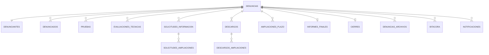
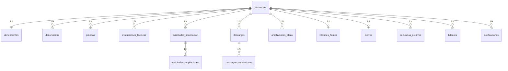

# Esquema BD — Negocio (Sistema de Gestión de Denuncias UTLCC)

> 📝 **Tablas del dominio del proyecto.** Ver también:
> - `Esquema BD - Librerías.md` — Tablas de Breeze (auth) + Auditing (generadas por paquetes)
> - `Esquema BD - Catálogos.md` — Tablas pequeñas de referencia (categorías, unidades, feriados, config)

**Stack fijo:** MySQL (Laragon) + Eloquent con cast JSON. Portable a JSONB (Postgres).

## 📌 Convenciones

- **Días hábiles** en todos los plazos (Lun–Vie, sin Sáb/Dom/feriados).
- **Soft delete** (`eliminado` / `deleted_at`) para preservar trazabilidad.
- **MAYÚSCULAS** en textos libres (backend: `Str::upper()`, frontend: `text-transform: uppercase`).
- **Filosofía "minimizar tablas"**: historial de ediciones como campos **JSON**, no tablas separadas.
- **Archivos físicos**: no se borran en soft delete, se mueven a `archivos_eliminados/`.
- Timestamps Laravel implícitos en todas las tablas.

## 📐 Diagrama ER

---

### 1. Tabla: `denuncias`
*Registro central de denuncias ciudadanas. Entidad raíz del sistema que gobierna todo el flujo procesal desde la recepción hasta el cierre o archivo.*

- **`id`**: Entero, Llave Primaria (Autoincremental).
- **`ticket`**: Texto, Único, Obligatorio (formato `DEN-YYYY-NNNN`, ej. "DEN-2026-0001"). Generado secuencialmente al registrar.
- **`token_consulta`**: Texto(4), Obligatorio (PIN numérico de 4 dígitos, ej. "1001"). Generado aleatoriamente al registrar. Usado junto con `ticket` como par de autenticación para el seguimiento público (Sprint 6).
- **`tipo`**: Enum(`'corrupcion'`, `'negacion'`), Obligatorio. **(Actualizado Julio 2026: se eliminaron `acompaniamiento` e `intervencion` del MVP, diferidos a Sprint 22 v2).**
  - `corrupcion`: Plazo legal hasta 45 días hábiles + 45 de ampliación (Art. 30).
  - `negacion`: Plazo legal hasta 20 días hábiles + 10 de ampliación.
- **`escenario`**: Enum(`'revelada'`, `'anonimo'`, `'reservada'`), por defecto `'revelada'`.
  - `revelada`: Identidad del denunciante visible para todos con acceso al caso.
  - `anonimo`: Sin datos de denunciante (Art. 22 §IV Ley 974).
  - `reservada`: Identidad oculta para terceros, visible solo para usuarios con acceso al caso (Art. 24).
- **`estado`**: Enum(`'ingresada'`, `'evaluacion_tecnica'`, `'admitida'`, `'rechazada'`, `'asignada'`, `'investigacion'`, `'informe'`, `'cerrada'`), por defecto `'ingresada'`.
- **`subestado`**: Enum(`'archivada'`, `NULL`), Nullable. Solo aplicable cuando `estado = 'cerrada'`.
- **`categoria_id`**: Entero, **Llave Foránea** → `categorias_denuncia(id)`. Categoría de los hechos (ej. cohecho, peculado).
- **`fecha_hechos`**: Fecha, Nullable. Fecha de los hechos denunciados.
- **`hora_hechos`**: Texto, Nullable. Hora aproximada de los hechos.
- **`lugar_hechos`**: Texto, Nullable. Ubicación donde ocurrieron los hechos.
- **`hechos`**: Texto largo, Obligatorio. Relación detallada de los hechos denunciados.
- **`declaracion_jurada`**: Booleano, por defecto `true`. El denunciante confirma la veracidad de su declaración.
- **`tecnico_id`**: Entero, **Llave Foránea** → `usuarios(id)`, Nullable. Técnico actualmente asignado al caso.
- **`tecnico_anterior_id`**: Entero, **Llave Foránea** → `usuarios(id)`, Nullable. Técnico previo en caso de traspaso.
- **`fecha_admitida`**: Timestamp, Nullable. Momento de admisión (plazo legal: 5 días desde ingreso, Art. 23).
- **`justificacion_admision`**: Texto, Nullable.
- **`fecha_rechazada`**: Timestamp, Nullable.
- **`justificacion_rechazo`**: Texto, Nullable. Motivo interno/legal del rechazo (Art. 23 §II).
- **`resumen_rechazo`**: Texto(200), Nullable. Resumen breve para el denunciante visible en seguimiento público.
- **`fecha_asignada`**: Timestamp, Nullable. Momento de asignación de técnico.
- **`fecha_traspaso`**: Timestamp, Nullable. Momento del último traspaso entre técnicos.
- **`justificacion_traspaso`**: Texto, Nullable. Motivo del traspaso (mín. 10 caracteres).
- **`fecha_reapertura`**: Timestamp, Nullable. Momento de reapertura (desde `rechazada` o `cerrada` → `ingresada`).
- **`justificacion_reapertura`**: Texto, Nullable. Motivo de la reapertura (mín. 20 caracteres).
- **`plazo_reapertura`**: Fecha, Nullable. Nueva fecha límite manual definida por el Jefe al reabrir.
- **`registrado_por_id`**: Entero, **Llave Foránea** → `usuarios(id)`, Nullable. Usuario registrador que ingresó la denuncia.

> 🆕 **Campos Sprint 7.5 (conciliación de fechas):**
> - **`sitpreco_rechazo`**: Texto(50), Nullable. SITPRECO opcional capturado al rechazar la denuncia (no se pide al admitir).
> - **`conciliado_por_id`**: Entero, **Llave Foránea** → `usuarios(id)`, Nullable. Jefe que realizó la conciliación.
> - **`conciliacion_motivo`**: Texto, Nullable. Motivo de la conciliación (mín. 20 caracteres).
> - **`conciliacion_at`**: Timestamp, Nullable. Momento de la conciliación.
> - **`fecha_cierre_real`**: Fecha, Nullable. Fecha real de cierre del caso (puede diferir de la fecha de cierre del sistema por conciliación).
> - **`es_legacy`**: Booleano, por defecto `false`. Sprint 23 (diferido): marca casos migrados del sistema legacy (sin historial automático).

> ~~**Nota sobre tipos especiales:** Para `acompaniamiento` e `intervencion`, los campos de hechos y plazo no aplican de la misma forma.~~ **(Eliminada Julio 2026: acomp/intervención se difirieron a Sprint 22 v2, no requieren tabla especial).**

---

### 2. Tabla: `denunciantes`
*Datos del ciudadano que presenta la denuncia. Separado de `denuncias` para proteger la reserva de identidad (Art. 24, 29 Ley 974).*

- **`id`**: Entero, Llave Primaria (Autoincremental).
- **`denuncia_id`**: Entero, **Llave Foránea** → `denuncias(id)`, Único. Relación 1:1 con la denuncia.
- **`nombres`**: Texto, Nullable. Vacío si `escenario = 'anonimo'`.
- **`ci`**: Texto, Nullable. Cédula de identidad (opcional según decisión Junio 2026).
- **`email`**: Texto, Nullable. Correo electrónico (100% opcional en modo anónimo).
- **`telefono`**: Texto, Nullable. Teléfono de contacto (100% opcional en modo anónimo).

---

### 3. Tabla: `denunciados`
*Personas señaladas en la denuncia. Una denuncia puede tener múltiples denunciados (bloques dinámicos en el formulario).*

- **`id`**: Entero, Llave Primaria (Autoincremental).
- **`denuncia_id`**: Entero, **Llave Foránea** → `denuncias(id)`. Relación N:1.
- **`orden`**: Entero, por defecto `0`. Posición del denunciado en el formulario (para preservar el índice `denunciado_idx`).
- **`conoce_identidad`**: Booleano, Obligatorio. Si el denunciante conoce la identidad del presunto responsable.
- **`nombres`**: Texto, Nullable. Nombre y apellidos (si `conoce_identidad = true`).
- **`dependencia`**: Texto, Nullable. Cargo y/o área de trabajo (opcional).
- **`descripcion`**: Texto, Nullable. Descripción física y vestimenta (si `conoce_identidad = false`). **Texto libre → MAYÚSCULAS** (Sprint 7.5).

---

### 4. Tabla: `pruebas`
*Evidencias adjuntas a la denuncia: archivos, pruebas físicas o datos de testigos. Una denuncia puede tener múltiples pruebas (bloques dinámicos).*

- **`id`**: Entero, Llave Primaria (Autoincremental).
- **`denuncia_id`**: Entero, **Llave Foránea** → `denuncias(id)`. Relación N:1.
- **`tipo`**: Enum(`'archivo'`, `'fisica'`, `'testigo'`), Obligatorio.
  - `archivo`: Evidencia digital con upload.
  - `fisica`: Prueba física descrita textualmente (sin upload).
  - `testigo`: Datos de contacto del testigo.
- **`descripcion`**: Texto, Obligatorio. Descripción de la prueba o testimonio. **Texto libre → MAYÚSCULAS** (Sprint 7.5).
- **`archivo_nombre`**: Texto, Nullable. Nombre del archivo subido (solo si `tipo = 'archivo'`).
- **`archivo_path`**: Texto, Nullable. Ruta de almacenamiento del archivo en disco/S3.
- **`archivo_tamano`**: Texto, Nullable. Tamaño legible (ej. "2.4 MB").
- **`testigo_nombre`**: Texto, Nullable. Nombre del testigo (solo si `tipo = 'testigo'`).
- **`testigo_telefono`**: Texto, Nullable. Teléfono de contacto del testigo.

### 7.5 Tabla: `denuncias_archivos` (NUEVA — Sprint 7.6)
*Repositorio unificado de archivos del caso (Sprint 7.6). Permite subir archivos en cualquier momento del caso, no solo al final. Convive con los archivos específicos por fase (`solicitudes_archivos`, `descargos_documentos`, `informes_archivos`, `cierres_archivos`).*

- **`id`**: Entero, Llave Primaria (Autoincremental).
- **`denuncia_id`**: Entero, **Llave Foránea** → `denuncias(id)`. Relación N:1.
- **`usuario_id`**: Entero, **Llave Foránea** → `usuarios(id)`. Usuario que subió el archivo.
- **`nombre`**: Texto, Obligatorio (ej. "acta_notarial_2026.pdf"). **Respetar case original del archivo** (no MAYÚSCULAS — es nombre técnico).
- **`path`**: Texto, Obligatorio. Ruta de almacenamiento en disco/S3.
- **`tamano`**: Texto, Nullable (ej. "2.4 MB").
- **`mime_type`**: Texto, Nullable (ej. "application/pdf").
- **`descripcion`**: Texto, Nullable. Descripción del archivo. **Texto libre → MAYÚSCULAS** (Sprint 7.5).
- **`contexto`**: Enum(`'registro'`, `'general'`, `'informe'`, `'cierre'`), por defecto `'general'`. Indica el contexto del archivo.
- **`contexto_id`**: Entero, Nullable. ID de la entidad relacionada (solicitud, descargo, informe, cierre) si aplica. FK polimórfica lógica.
- **`eliminado`**: Booleano, por defecto `false`. Soft delete (archivo físico se preserva en `archivos_eliminados/`).
- **`fecha_eliminacion`**: Timestamp, Nullable.
- **`fecha_subida`**: Timestamp, Obligatorio.

> **Comportamiento del soft delete (Sprint 7.6):** El archivo "eliminado" desaparece de la UI pero el archivo físico se preserva en disco (movido a `archivos_eliminados/` con timestamp). La DB mantiene el registro con `eliminado: true` para auditoría forense.

---

### 5. Tabla: `evaluaciones_tecnicas`
*Evaluaciones técnicas previas delegadas por el Jefe de Unidad a un técnico antes de admitir o rechazar la denuncia (Sprint 7). El plazo de 5 días de admisión (Art. 23) NO se pausa durante esta evaluación.*

- **`id`**: Entero, Llave Primaria (Autoincremental).
- **`denuncia_id`**: Entero, **Llave Foránea** → `denuncias(id)`. Una denuncia puede tener múltiples evaluaciones en su historial (si se reasumió y volvió a delegar).
- **`tecnico_id`**: Entero, **Llave Foránea** → `usuarios(id)`. Técnico al que se delegó la evaluación.
- **`delegada_por_id`**: Entero, **Llave Foránea** → `usuarios(id)`. Jefe que delegó (siempre rol `jefe`).
- **`delegada_at`**: Timestamp, Obligatorio. Momento de la delegación.
- **`justificacion_delegacion`**: Texto, Nullable. Motivo de la delegación.
- **`texto_evaluacion`**: Texto largo, Nullable. Evaluación técnica resumida redactada por el técnico al devolver.
- **`recomendacion`**: Enum(`'admitir'`, `'rechazar'`, `NULL`), Nullable. Recomendación del técnico.
- **`devuelta_at`**: Timestamp, Nullable. Momento en que el técnico devolvió la evaluación al Jefe.
- **`devuelta_por_id`**: Entero, **Llave Foránea** → `usuarios(id)`, Nullable. Técnico que devolvió.
- **`estado`**: Enum(`'pendiente'`, `'devuelta'`), por defecto `'pendiente'`.

---

### 6. Tabla: `solicitudes_informacion`
*Solicitudes de documentación dirigidas a unidades/dependencias externas durante la investigación de la denuncia (Art. 25 §I y §III Ley 974). Plazo legal: 10 días hábiles, ampliable hasta 5 días adicionales.*

- **`id`**: Entero, Llave Primaria (Autoincremental).
- **`denuncia_id`**: Entero, **Llave Foránea** → `denuncias(id)`. Relación N:1.
- **`unidad_destino_id`**: Entero, **Llave Foránea** → `unidades_externas(id)`. Unidad a la que se dirige la solicitud.
- **`detalle`**: Texto, Obligatorio. Descripción de la información solicitada. **Texto libre → MAYÚSCULAS** (Sprint 7.5).
- **`plazo_dias`**: Entero, por defecto `10`. Plazo concedido en días hábiles (rango 1–45).
- **`fecha_envio`**: Timestamp, Obligatorio. **(Actualizado Sprint 7.5: editable por el usuario, no se asigna automáticamente a `now()`).** Momento real de envío de la solicitud.
- **`fecha_vencimiento`**: Timestamp, Obligatorio. Fecha límite calculada en días hábiles desde `fecha_envio`.
- **`fecha_respuesta`**: Timestamp, Nullable. **(Actualizado Sprint 7.5: editable por el usuario vía date picker).** Momento en que la unidad respondió.
- **`respuesta`**: Texto, Nullable. Contenido de la respuesta recibida. **Texto libre → MAYÚSCULAS** (Sprint 7.5).
- **`estado`**: Enum(`'pendiente'`, `'ampliada'`, `'respondida'`, `'cancelada'`), por defecto `'pendiente'`.
- **`motivo_cancelacion`**: Texto, Nullable. Motivo de la cancelación (mín. 5 caracteres). **Texto libre → MAYÚSCULAS** (Sprint 7.5).
- **`fecha_cancelacion`**: Timestamp, Nullable.
- **`eliminado`**: Booleano, por defecto `false`. Soft delete para preservar auditoría.
- **`fecha_eliminacion`**: Timestamp, Nullable.
- **`historial_ediciones`**: JSON, Nullable. **(Sprint 14: fusión de la antigua tabla `solicitudes_ediciones`).** Almacena array con `{fecha, campo, anterior, nuevo, usuario_id}` por cada edición. Eloquent cast `array`. Portable a `JSONB` (Postgres) si en el futuro se migra.

---

### 7. Tabla: `solicitudes_archivos`
*Archivos adjuntos a las respuestas de solicitudes de información.*

- **`id`**: Entero, Llave Primaria (Autoincremental).
- **`solicitud_id`**: Entero, **Llave Foránea** → `solicitudes_informacion(id)`.
- **`nombre`**: Texto, Obligatorio (ej. "comprobantes_pago_ambulancias.pdf").
- **`path`**: Texto, Obligatorio. Ruta de almacenamiento.
- **`tamano`**: Texto, Nullable (ej. "2.4 MB").
- **`fecha_subida`**: Timestamp, Obligatorio.

---

### 8. Tabla: `solicitudes_ampliaciones`
*Registro de ampliaciones de plazo concedidas a solicitudes de información (máximo 5 días adicionales).*

- **`id`**: Entero, Llave Primaria (Autoincremental).
- **`solicitud_id`**: Entero, **Llave Foránea** → `solicitudes_informacion(id)`.
- **`dias`**: Entero, Obligatorio (máx. 5).
- **`justificacion`**: Texto, Obligatorio (mín. 10 caracteres).
- **`fecha`**: Timestamp, Obligatorio.

---

### 9. Tabla: `solicitudes_ediciones`
*Historial de cambios realizados a solicitudes de información. Auditoría inmutable de cada modificación.*

- **`id`**: Entero, Llave Primaria (Autoincremental).
- **`solicitud_id`**: Entero, **Llave Foránea** → `solicitudes_informacion(id)`.
- **`campo`**: Texto, Obligatorio (ej. `'unidad_destino'`, `'detalle'`, `'plazo_dias'`).
- **`valor_anterior`**: Texto, Nullable.
- **`valor_nuevo`**: Texto, Obligatorio.
- **`usuario_id`**: Entero, **Llave Foránea** → `usuarios(id)`. Autor de la edición.
- **`fecha`**: Timestamp, Obligatorio.

---

### 10. Tabla: `descargos`
*Descargos de los denunciados: notificación, recepción de descargo y documentación de respaldo (Art. 25 §IV Ley 974). Plazo legal: 10 días hábiles + 5 de prórroga.*

- **`id`**: Entero, Llave Primaria (Autoincremental).
- **`denuncia_id`**: Entero, **Llave Foránea** → `denuncias(id)`. Relación N:1.
- **`denunciado_id`**: Entero, **Llave Foránea** → `denunciados(id)`. Denunciado al que se notifica.
- **`fecha_notificacion`**: Timestamp, Nullable. Momento de notificación formal.
- **`medio`**: **Texto(200), Nullable. (Actualizado Sprint 7.5: pasa de ENUM a texto libre.)** Descripción libre del medio de notificación (ej. "Cédula de notificación N° 234", "Email institucional", "WhatsApp", etc.). **Texto libre → MAYÚSCULAS** (Sprint 7.5).
- **`respaldo_archivo_nombre`**: Texto, Nullable. Nombre del archivo respaldo de la notificación (ej. cédula de notificación).
- **`respaldo_archivo_path`**: Texto, Nullable.
- **`respaldo_archivo_tamano`**: Texto, Nullable.
- **`fecha_vencimiento`**: Timestamp, Nullable. Calculada: 10 días hábiles desde `fecha_notificacion`.
- **`fecha_respuesta`**: Timestamp, Nullable. Momento de recepción del descargo.
- **`resumen_descargo`**: Texto largo, Nullable. Resumen del descargo presentado por el denunciado. **Texto libre → MAYÚSCULAS** (Sprint 7.5).
- **`estado`**: Enum(`'pendiente_notif'`, `'notificado'`, `'ampliado'`, `'respondido'`, `'cancelado'`), por defecto `'pendiente_notif'`.
- **`motivo_cancelacion`**: Texto, Nullable. **Texto libre → MAYÚSCULAS** (Sprint 7.5).
- **`fecha_cancelacion`**: Timestamp, Nullable.
- **`eliminado`**: Booleano, por defecto `false`. Soft delete.
- **`fecha_eliminacion`**: Timestamp, Nullable.
- **`historial_ediciones`**: JSON, Nullable. **(Sprint 14: fusión de la antigua tabla `descargos_ediciones`).** Almacena array con `{fecha, campo, anterior, nuevo, usuario_id}` por cada edición. Eloquent cast `array`. Portable a `JSONB` (Postgres) si en el futuro se migra.

---

### 11. Tabla: `descargos_documentos`
*Documentos de respaldo adjuntados por el denunciado en su descargo.*

- **`id`**: Entero, Llave Primaria (Autoincremental).
- **`descargo_id`**: Entero, **Llave Foránea** → `descargos(id)`.
- **`nombre`**: Texto, Obligatorio.
- **`path`**: Texto, Obligatorio.
- **`tamano`**: Texto, Nullable.
- **`fecha_subida`**: Timestamp, Obligatorio.

---

### 12. Tabla: `descargos_ampliaciones`
*Registro de ampliaciones de plazo concedidas a descargos (máximo 5 días adicionales, Art. 25 §IV).*

- **`id`**: Entero, Llave Primaria (Autoincremental).
- **`descargo_id`**: Entero, **Llave Foránea** → `descargos(id)`.
- **`dias`**: Entero, Obligatorio (máx. 5).
- **`justificacion`**: Texto, Obligatorio (mín. 10 caracteres).
- **`fecha`**: Timestamp, Obligatorio.

---

### 13. Tabla: `descargos_ediciones`
*Historial de cambios en descargos para auditoría.*

- **`id`**: Entero, Llave Primaria (Autoincremental).
- **`descargo_id`**: Entero, **Llave Foránea** → `descargos(id)`.
- **`campo`**: Texto, Obligatorio (ej. `'nombres_denunciado'`, `'dependencia_denunciado'`).
- **`valor_anterior`**: Texto, Nullable.
- **`valor_nuevo`**: Texto, Obligatorio.
- **`usuario_id`**: Entero, **Llave Foránea** → `usuarios(id)`.
- **`fecha`**: Timestamp, Obligatorio.

---

### 14. Tabla: `ampliaciones_plazo`
*Ampliaciones del plazo total de la denuncia aprobadas por el Jefe de Unidad (Sprint 8). Se permiten múltiples ampliaciones parciales hasta el máximo legal (corrupción: +45 días, negación: +10 días).*

- **`id`**: Entero, Llave Primaria (Autoincremental).
- **`denuncia_id`**: Entero, **Llave Foránea** → `denuncias(id)`. Relación N:1.
- **`numero`**: Entero, Obligatorio. Número secuencial de la ampliación (1, 2, 3...).
- **`dias`**: Entero, Obligatorio. Días hábiles concedidos en esta ampliación.
- **`justificacion`**: Texto, Obligatorio.
- **`aprobado_por_id`**: Entero, **Llave Foránea** → `usuarios(id)`. Jefe que aprobó.
- **`solicitado_por`**: Texto, Nullable. Nombre o referencia de quien solicitó la ampliación (ej. "Técnico Carlos Quispe").
- **`archivo_respaldo`**: Texto, Nullable. Ruta del archivo de respaldo si aplica.
- **`fecha`**: Timestamp, Obligatorio.

---

### 15. Tabla: `informes_finales`
*Informe Final emitido por el técnico al concluir la investigación, dirigido a la Máxima Autoridad Institucional (Art. 26 Ley 974). Relación 1:1 con la denuncia. Soporta ediciones y soft delete.*

- **`id`**: Entero, Llave Primaria (Autoincremental).
- **`denuncia_id`**: Entero, **Llave Foránea** → `denuncias(id)`, Único.
- **`clasificacion`**: Enum(`'penal'`, `'civil'`, `'administrativo'`, `'sin_indicios'`, `'medida_correctiva'`, `'archivado'`), Obligatorio. Determina la derivación (Art. 26 §II):
  - `penal`: Remitir al Ministerio Público.
  - `administrativo`: Remitir a la MAE para acciones administrativas.
  - `civil`: Remitir a Auditoría Interna.
  - `sin_indicios` / `archivado`: Archivar antecedentes (Art. 27).
  - `medida_correctiva`: Suspender proceso de contratación en curso.
- **`sitpreco`**: Texto, Nullable. Código SITPRECO del sistema nacional de Bolivia (opcional, solo en informe final).
- **`fojas`**: Entero, Nullable. Número de fojas del expediente.
- **`justificacion`**: Texto largo, Nullable. Justificación y conclusiones del informe.
- **`concluido_por`**: Texto, Obligatorio. Nombre del técnico que redactó el informe.
- **`redactado_at`**: Timestamp, Obligatorio.
- **`eliminado`**: Booleano, por defecto `false`. Soft delete.
- **`fecha_eliminacion`**: Timestamp, Nullable.
- **`historial_ediciones`**: JSON, Nullable. **(Sprint 14: fusión de la antigua tabla `informes_ediciones`).** Almacena array con `{cambios, usuario_id, fecha}` por cada edición. Eloquent cast `array`. Portable a `JSONB` (Postgres).

---

### 16. Tabla: `informes_archivos`
*Archivos adjuntos al Informe Final.*

- **`id`**: Entero, Llave Primaria (Autoincremental).
- **`informe_id`**: Entero, **Llave Foránea** → `informes_finales(id)`.
- **`nombre`**: Texto, Obligatorio.
- **`path`**: Texto, Obligatorio.
- **`tamano`**: Texto, Nullable.
- **`fecha_subida`**: Timestamp, Obligatorio.

---

### 17. Tabla: `informes_ediciones`
*Historial de ediciones del Informe Final para auditoría y trazabilidad.*

- **`id`**: Entero, Llave Primaria (Autoincremental).
- **`informe_id`**: Entero, **Llave Foránea** → `informes_finales(id)`.
- **`cambios`**: JSON, Obligatorio. Array de strings describiendo los campos modificados (ej. `["clasificacion: 'civil' → 'penal'", "fojas: '12' → '15'"]`).
- **`usuario_id`**: Entero, **Llave Foránea** → `usuarios(id)`. Autor de la edición.
- **`fecha`**: Timestamp, Obligatorio.

---

### 18. Tabla: `cierres`
*Cierre formal de la denuncia. Relación 1:1 con la denuncia. Incluye datos de notificación al denunciante y SITPRECO heredado del informe. Soporta ediciones y soft delete.*

- **`id`**: Entero, Llave Primaria (Autoincremental).
- **`denuncia_id`**: Entero, **Llave Foránea** → `denuncias(id)`, Único.
- **`notificado_denunciante`**: Booleano, Obligatorio. Si se notificó al denunciante del cierre.
- **`notificacion_medio`**: Texto, Nullable. Medio de notificación (ej. "email", "personal", "carta").
- **`notificacion_fecha`**: Timestamp, Nullable. Fecha de notificación al denunciante.
- **`notificacion_descripcion`**: Texto, Nullable. Detalle de la notificación.
- **`no_notificado_motivo`**: Texto, Nullable. Motivo si NO se notificó (ej. "Denunciante anónimo sin datos de contacto").
- **`concluido_por`**: Texto, Obligatorio. Nombre del técnico que cerró el caso.
- **`descripcion`**: Texto, Nullable. Descripción del cierre y observaciones finales. **Texto libre → MAYÚSCULAS** (Sprint 7.5).
- **`cerrado_at`**: Timestamp, Obligatorio. Momento del cierre.
- **`eliminado`**: Booleano, por defecto `false`. Soft delete (si se elimina, la denuncia vuelve a estado `informe`).
- **`fecha_eliminacion`**: Timestamp, Nullable.
- **`historial_ediciones`**: JSON, Nullable. **(Sprint 14: fusión de la antigua tabla `cierres_ediciones`).** Almacena array con `{cambios, usuario_id, fecha}` por cada edición. Eloquent cast `array`. Portable a `JSONB` (Postgres).

---

### 19. Tabla: `cierres_archivos`
*Archivos adjuntos al acta de cierre (ej. acta_cierre_0011.pdf).*

- **`id`**: Entero, Llave Primaria (Autoincremental).
- **`cierre_id`**: Entero, **Llave Foránea** → `cierres(id)`.
- **`nombre`**: Texto, Obligatorio.
- **`path`**: Texto, Obligatorio.
- **`tamano`**: Texto, Nullable.
- **`fecha_subida`**: Timestamp, Obligatorio.

---

### 20. Tabla: `cierres_ediciones`
*Historial de ediciones del cierre para auditoría.*

- **`id`**: Entero, Llave Primaria (Autoincremental).
- **`cierre_id`**: Entero, **Llave Foránea** → `cierres(id)`.
- **`cambios`**: JSON, Obligatorio. Array de strings con los campos modificados.
- **`usuario_id`**: Entero, **Llave Foránea** → `usuarios(id)`.
- **`fecha`**: Timestamp, Obligatorio.

---

### 21. Tabla: `bitacora`
*Bitácora inmutable de todas las acciones realizadas sobre una denuncia. Cada entrada registra un evento del ciclo de vida para auditoría legal completa.*

- **`id`**: Entero, Llave Primaria (Autoincremental).
- **`denuncia_id`**: Entero, **Llave Foránea** → `denuncias(id)`. Relación N:1.
- **`accion`**: Texto, Obligatorio. Tipo de acción (ej. `'admitida'`, `'rechazada'`, `'asignada'`, `'traspaso'`, `'reapertura'`, `'investigacion'`, `'evaluacion_delegada'`, `'evaluacion_devuelta'`, `'evaluacion_reasumida'`, `'solicitud_creada'`, `'solicitud_respondida'`, `'solicitud_ampliada'`, `'descargo_notificado'`, `'descargo_respondido'`, `'descargo_ampliado'`, `'saltar_fase'`, `'ampliacion_plazo'`, `'conciliacion_fechas'`, `'informe_redactado'`, `'informe_editado'`, `'informe_eliminado'`, `'cierre_registrado'`, `'cierre_editado'`, `'cierre_eliminado'`).
  - ~~`'consulta_codigo'`~~ **(Eliminado Julio 2026 — Sprint 7.7: la consulta de código por Registrador NO se registra en bitácora, por decisión del cliente).**
- **`detalle`**: Texto, Obligatorio. Descripción legible de la acción (ej. "Asignada a Carlos Quispe", "Plazo ampliado 15 días (ampliación #1)"). **Texto libre → MAYÚSCULAS** (Sprint 7.5).
- **`usuario_id`**: Entero, **Llave Foránea** → `usuarios(id)`. Autor de la acción.
- **`fecha`**: Timestamp, Obligatorio.

---

### 22. Tabla: `notificaciones`
*Notificaciones push internas del sistema, mostradas en la campana del navbar y en la página de historial (Sprint 9). Generadas por derivación de eventos del sistema y persistidas al ser leídas.*

- **`id`**: Entero, Llave Primaria (Autoincremental).
- **`usuario_id`**: Entero, **Llave Foránea** → `usuarios(id)`. Destinatario de la notificación.
- **`tipo`**: Texto, Obligatorio. Tipo de evento (ej. `'traspaso'`, `'ampliacion'`, `'denuncia_admitida'`, `'denuncia_rechazada'`, `'plazo_por_vencer'`, `'plazo_vencido'`, `'plazo_informe'`, `'solicitud_vence'`, `'descargo_vence'`, `'sistema'`).
- **`titulo`**: Texto, Obligatorio (ej. "Caso traspasado", "Plazo total por vencer"). **Texto libre → MAYÚSCULAS** (Sprint 7.5).
- **`mensaje`**: Texto, Obligatorio (ej. "DEN-2026-0006 fue asignado a Luis Mamani"). **Texto libre → MAYÚSCULAS** (Sprint 7.5).
- **`ticket`**: Texto, Nullable. Ticket de la denuncia relacionada (para navegación directa).
- **`destino_url`**: Texto, Obligatorio. URL de destino al hacer clic en la notificación.
- **`icono`**: Texto, por defecto `'Bell'`. Nombre del icono Lucide React a mostrar.
- **`color`**: Texto, por defecto `'primary'`. Clase de color semántico (`'info'`, `'warning'`, `'destructive'`, `'success'`, `'primary'`).
- **`leida`**: Booleano, por defecto `false`.
- **`fecha_leida`**: Timestamp, Nullable.
- **`fecha`**: Timestamp, Obligatorio. Momento de generación de la notificación.

---

## 📊 Diagrama de Relaciones (Resumen Visual)

> **Nota:** Las relaciones con `users` (FKs: técnico, autor, quien sube, etc.) están en `Esquema BD - Librerías.md`.
> Las relaciones con catálogos (`categorias_denuncia`, `unidades_externas`, `feriados`) están en `Esquema BD - Catálogos.md`.
> Las tablas `*_ediciones` fueron fusionadas a campos JSON en sus tablas padre.

---

## 📝 Notas de Implementación para la Fase 1

### Migración desde Fase 0 (Mock → BD real)
La arquitectura actual de `app/Data/` (clases estáticas con sesión) fue diseñada para que la transición a la BD real solo requiera cambiar la fuente de datos en los controladores. Los componentes React **no cambian**.

| Fase 0 (Mock)                     | Fase 1 (BD real)                        |
|------------------------------------|-----------------------------------------|
| `DenunciaData::find($ticket)`      | `Denuncia::where('ticket', $ticket)->first()` |
| `SolicitudData::getByTicket()`     | `$denuncia->solicitudes()->active()->get()`   |
| `SesionUsuarioData::getCurrent()`  | `Auth::user()`                          |
| `session('denuncias_mock')`        | Eloquent ORM / MySQL                    |
| `session('permisos_demo')`         | (Sprint 15) `Auth::user()->can('x')` + `spatie/laravel-permission` si se requiere granularidad |

### Filosofía "minimizar tablas" (Sprint 14)
Tablas puramente históricas (sin CRUD, solo información derivada) se fusionan como **campos JSON** en su tabla padre. Esto reduce la BD de 26 a 22 tablas y simplifica queries de lectura.

| Tabla antigua (Fase 0) | Campo nuevo (Fase 1) | Razón |
|---|---|---|
| `solicitudes_ediciones` | `solicitudes_informacion.historial_ediciones` (JSON) | Sin CRUD; solo historial |
| `descargos_ediciones` | `descargos.historial_ediciones` (JSON) | Sin CRUD; solo historial |
| `informes_ediciones` | `informes_finales.historial_ediciones` (JSON) | Sin CRUD; solo historial |
| `cierres_ediciones` | `cierres.historial_ediciones` (JSON) | Sin CRUD; solo historial |

**Tipo de dato en MySQL:** `JSON` nativo. Eloquent cast: `protected $casts = ['historial_ediciones' => 'array']`.
**Portable a Postgres:** cambiar a `JSONB` con índice GIN si en el futuro se requiere búsqueda eficiente dentro del JSON.

> **Trade-off:** las queries de auditoría forense son más lentas que en una tabla relacional normal. Para una BD institucional mediana (cientos a miles de denuncias/año), el impacto es despreciable. Si llegara a ser problema, se puede crear un índice generado en MySQL 8 sobre campos específicos del JSON.

### MAYÚSCULAS en textos libres (Sprint 7.5)
Todos los campos de texto libre se almacenan en MAYÚSCULAS por convención institucional. Se aplica:
- **Backend:** `Str::upper()` antes del `save()` mediante el trait `UppercaseText` (Sprint 7.5).
- **Frontend:** `text-transform: uppercase` en inputs/textareas con CSS, más helper visual "Se guardará en MAYÚSCULAS".

**Campos afectados (lista completa):**

| Tabla | Campo |
|---|---|
| `denunciantes` | `nombres`, `ci` |
| `denunciados` | `nombres`, `dependencia`, `descripcion` |
| `pruebas` | `descripcion` |
| `denuncias` | `lugar_hechos`, `hechos`, `justificacion_*`, `resumen_rechazo`, `conciliacion_motivo` |
| `denuncias_archivos` | `descripcion` |
| `solicitudes_informacion` | `detalle`, `respuesta`, `motivo_cancelacion` |
| `solicitudes_ampliaciones` | `justificacion` |
| `descargos` | `medio`, `resumen_descargo`, `motivo_cancelacion` |
| `descargos_ampliaciones` | `justificacion` |
| `ampliaciones_plazo` | `justificacion`, `solicitado_por` |
| `informes_finales` | `justificacion`, `concluido_por` |
| `cierres` | `descripcion`, `notificacion_medio`, `notificacion_descripcion`, `no_notificado_motivo`, `concluido_por` |
| `bitacora` | `detalle` |
| `evaluaciones_tecnicas` | `texto_evaluacion`, `justificacion_delegacion` |
| `notificaciones` | `titulo`, `mensaje` |
| `feriados` | `nombre` |
| `categorias_denuncia` | `nombre`, `descripcion` |
| `unidades_externas` | `nombre` |
| `usuarios` | `nombre` |
| `configuracion_sistema` | `descripcion` |

**Campos NO afectados (mantienen case original):**
- `email`, `password`, `ticket` (auto-generado), `token_consulta` (auto-generado)
- `archivo_nombre`, `archivo_path` (respetar case original del archivo)
- URLs, paths, códigos de sistema
- Valores de ENUM (lowercase por convención)

### Índices recomendados
- `denuncias`: Índice único en `ticket`. Índice en `estado`. Índice en `tecnico_id`. Índice en `es_legacy` (Sprint 23).
- `solicitudes_informacion`: Índice en `denuncia_id`. Índice en `estado`.
- `descargos`: Índice en `denuncia_id`. Índice en `estado`.
- `bitacora`: Índice en `denuncia_id`. Índice en `fecha DESC`.
- `notificaciones`: Índice compuesto en `(usuario_id, leida, fecha DESC)`.
- `evaluaciones_tecnicas`: Índice en `(denuncia_id, estado)`.
- `denuncias_archivos`: Índice en `(denuncia_id, eliminado)`. Índice en `contexto`.
- `feriados`: Índice único en `fecha`. Índice en `recurrente`.
- `configuracion_sistema`: Índice único en `clave`.

### Plazos legales (referencia rápida)

| Concepto | Plazo | Base legal |
|----------|-------|------------|
| Admisión o rechazo | 5 días hábiles | Art. 23 Ley 974 |
| Solicitud de información | 10 días hábiles | Art. 25 §I y §III |
| Descargo del denunciado | 10 días hábiles + 5 de prórroga | Art. 25 §IV |
| Plazo total corrupción | 45 días hábiles + 45 de ampliación | Art. 30 |
| Plazo total negación | 20 días hábiles + 10 de ampliación | Art. 30 |
| Remisión al Ministerio | 2 días hábiles (si daño ≥ Bs 7M o MAE involucrada) | Art. 21, Art. 15 §I |

### Pendientes con el cliente (impactan esquema)
- **C1:** Días hábiles vs calendario → ✅ Resuelto (tabla `feriados`).
- **Archivar:** ¿Subestado de `cerrada` o proceso separado? → Actual: subestado.
- **C7:** Destino del expediente al remitirse al Ministerio.
- **C8:** Reglas del plazo al reabrir una denuncia.

### Sprints diferidos (anotaciones)
- **Sprint 22 (v2):** `acompaniamiento` e `intervencion` se podrían reincorporar al enum `denuncias.tipo` con un simple `ALTER TABLE`.
- **Sprint 23:** Tabla `configuracion_sistema` con `siguiente_numero_ticket` para continuación de numeración legacy.
- **Sprint 24 (v2):** Permisos granulares por usuario (no se contempla en Fase 0/1).

---

## 🆕 Resumen de cambios Julio 2026

### Tablas
- **Nueva:** `denuncias_archivos` (repositorio unificado, Sprint 7.6)
- **Nueva:** `configuracion_sistema` (Sprint 23, diferido)
- **Fusionadas a JSON (Sprint 14):** `solicitudes_ediciones`, `descargos_ediciones`, `informes_ediciones`, `cierres_ediciones` → campos `historial_ediciones` JSON en sus tablas padre

### Enums modificados
- `denuncias.tipo`: ❌ eliminados `acompaniamiento`, `intervencion` (Sprint 22 v2)
- `descargos.medio`: ❌ eliminados valores del ENUM → ahora texto libre (Sprint 7.5)
- `bitacora.accion`: ❌ eliminada `consulta_codigo` (Sprint 7.7)
- `bitacora.accion`: ➕ agregada `conciliacion_fechas` (Sprint 7.5)
- `denuncias_archivos.contexto`: ➕ nuevo ENUM `'registro' | 'general' | 'informe' | 'cierre'` (Sprint 7.6)

### Campos nuevos
- `denuncias.sitpreco_rechazo` (Sprint 7.A)
- `denuncias.conciliado_por_id`, `conciliacion_motivo`, `conciliacion_at`, `fecha_cierre_real` (Sprint 7.5)
- `denuncias.es_legacy` (Sprint 23, diferido)
- `solicitudes_informacion.historial_ediciones` JSON (Sprint 14, reemplaza tabla)
- `descargos.historial_ediciones` JSON (Sprint 14, reemplaza tabla)
- `descargos.medio`: ENUM → TEXT(200) (Sprint 7.5)
- `informes_finales.historial_ediciones` JSON (Sprint 14, reemplaza tabla)
- `cierres.historial_ediciones` JSON (Sprint 14, reemplaza tabla)

### Comportamiento
- MAYÚSCULAS obligatorias en textos libres (Sprint 7.5)
- Archivos físicos no se borran en soft delete (Sprint 7.6)
- Consulta de código no se registra en bitácora (Sprint 7.7)
