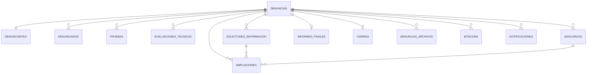
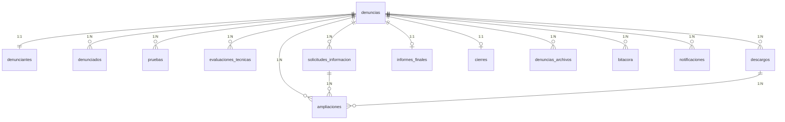

# Esquema BD — Negocio (Sistema de Gestión de Denuncias UTLCC)

> 📝 **Tablas del dominio del proyecto.** Ver también:
> - `Esquema BD - Librerías.md` — Tablas de Breeze (auth) + Auditing (generadas por paquetes)
> - `Esquema BD - Catálogos.md` — Tablas pequeñas de referencia (categorías, unidades, feriados, config)

**Stack fijo:** MySQL (Laragon) + Eloquent con cast JSON. Portable a JSONB (Postgres).

## 📌 Convenciones

- **Días hábiles** en todos los plazos (Lun–Vie, sin Sáb/Dom/feriados).
- **Soft delete** (`eliminado` / `deleted_at`) para preservar trazabilidad.
- **MAYÚSCULAS** en textos libres (backend: `Str::upper()`, frontend: `text-transform: uppercase`).
- **Filosofía "minimizar tablas"**: historial de ediciones como campos **JSON**, no tablas separadas.
- **Archivos físicos**: no se borran en soft delete, se mueven a `archivos_eliminados/`.
- Timestamps Laravel implícitos en todas las tablas.

## 📐 Diagrama ER

```mermaid
erDiagram
    DENUNCIAS ||--|| DENUNCIANTES : ""
    DENUNCIAS ||--o{ DENUNCIADOS : ""
    DENUNCIAS ||--o{ PRUEBAS : ""
    DENUNCIAS ||--o{ EVALUACIONES_TECNICAS : ""
    DENUNCIAS ||--o{ SOLICITUDES_INFORMACION : ""
    DENUNCIAS ||--o{ DESCARGOS : ""
    DENUNCIAS ||--o{ AMPLIACIONES : ""
    SOLICITUDES_INFORMACION ||--o{ AMPLIACIONES : ""
    DESCARGOS ||--o{ AMPLIACIONES : ""
    DENUNCIAS ||--o| INFORMES_FINALES : ""
    DENUNCIAS ||--o| CIERRES : ""
    DENUNCIAS ||--o{ DENUNCIAS_ARCHIVOS : ""
    DENUNCIAS ||--o{ BITACORA : ""
    DENUNCIAS ||--o{ NOTIFICACIONES : ""
```

---

### 1. Tabla: `denuncias`
*Registro central de denuncias ciudadanas. Entidad raíz del sistema que gobierna todo el flujo procesal desde la recepción hasta el cierre o archivo. Los datos históricos de traspaso, reapertura y conciliación se almacenan como campos JSON para reducir columnas sin perder trazabilidad.*

- **`id`**: Entero, Llave Primaria (Autoincremental).
- **`ticket`**: Texto, Único, Obligatorio (formato `DEN-YYYY-NNNN`, ej. "DEN-2026-0001"). Generado secuencialmente al registrar. Si se elimina una denuncia (soft delete por Jefe), su número se reusa para mantener numeración continua. El registro eliminado se preserva en auditoría.
- **`token_consulta`**: Texto(4), Obligatorio (PIN numérico de 4 dígitos, ej. "1001"). Generado aleatoriamente al registrar. Usado junto con `ticket` como par de autenticación para el seguimiento público (Sprint 6).
- **`tipo`**: Enum(`'corrupcion'`, `'negacion'`), Obligatorio.
  - `corrupcion`: Plazo legal hasta 45 días hábiles + 45 de ampliación (Art. 30).
  - `negacion`: Plazo legal hasta 20 días hábiles + 10 de ampliación.
- **`escenario`**: Enum(`'revelada'`, `'anonimo'`, `'reservada'`), por defecto `'revelada'`.
  - `revelada`: Identidad del denunciante visible para todos con acceso al caso.
  - `anonimo`: Sin datos de denunciante (Art. 22 §IV Ley 974).
  - `reservada`: Identidad oculta para terceros, visible solo para usuarios con acceso al caso (Art. 24).
- **`estado`**: Enum(`'ingresada'`, `'evaluacion_tecnica'`, `'admitida'`, `'rechazada'`, `'asignada'`, `'investigacion'`, `'informe'`, `'cerrada'`), por defecto `'ingresada'`.
- **`subestado`**: Enum(`'archivada'`, `NULL`), Nullable. Solo aplicable cuando `estado = 'cerrada'`.
- **`categoria_id`**: Entero, **Llave Foránea** → `categorias_denuncia(id)`. Categoría de los hechos (ej. cohecho, peculado).
- **`fecha_hechos`**: Fecha, Nullable. Fecha de los hechos denunciados.
- **`hora_hechos`**: Texto, Nullable. Hora aproximada de los hechos.
- **`lugar_hechos`**: Texto, Nullable. Ubicación donde ocurrieron los hechos.
- **`hechos`**: Texto largo, Obligatorio. Relación detallada de los hechos denunciados.
- **`declaracion_jurada`**: Booleano, por defecto `true`. El denunciante confirma la veracidad de su declaración.
- **`tecnico_id`**: Entero, **Llave Foránea** → `usuarios(id)`, Nullable. Técnico actualmente asignado al caso.
- **`tecnico_anterior_id`**: Entero, **Llave Foránea** → `usuarios(id)`, Nullable. Técnico previo en caso de traspaso.
- **`fecha_admitida`**: Timestamp, Nullable. Momento de admisión (plazo legal: 5 días desde ingreso, Art. 23).
- **`justificacion_admision`**: Texto, Nullable.
- **`fecha_rechazada`**: Timestamp, Nullable.
- **`justificacion_rechazo`**: Texto, Nullable. Motivo interno/legal del rechazo (Art. 23 §II).
- **`resumen_rechazo`**: Texto(200), Nullable. Resumen breve para el denunciante visible en seguimiento público.
- **`fecha_asignada`**: Timestamp, Nullable. Momento de asignación de técnico.
- **`registrado_por_id`**: Entero, **Llave Foránea** → `usuarios(id)`, Nullable. Usuario registrador que ingresó la denuncia.
- **`sitpreco_rechazo`**: Texto(50), Nullable. SITPRECO opcional capturado al rechazar la denuncia (no se pide al admitir).
- **`es_legacy`**: Booleano, por defecto `false`. Sprint 23 (diferido): marca casos migrados del sistema legacy (sin historial automático).
- **`deleted_at`**: Timestamp, Nullable. Soft delete: solo el Jefe de Unidad puede eliminar denuncias (el Registrador solo edita). La eliminación no afecta la numeración de tickets (se reusa el número).

> **JSON — Datos históricos (Sprint 9.2: fusión):** Campos que antes eran columnas separadas, ahora agrupados en JSON para reducir la tabla. Se leen siempre juntos y no se consultan individualmente.
> - **`traspaso_json`**: JSON, Nullable. `{ fecha: timestamp, justificacion: string }`. Datos del último traspaso entre técnicos.
> - **`reapertura_json`**: JSON, Nullable. `{ fecha: timestamp, justificacion: string, plazo: date }`. Datos de la reapertura del caso.
> - **`conciliacion_json`**: JSON, Nullable. `{ conciliado_por_id: int, motivo: string, fecha: timestamp, fecha_cierre_real: date }`. Datos de conciliación de fechas por el Jefe.

---

### 2. Tabla: `denunciantes`
*Datos del ciudadano que presenta la denuncia. Separado de `denuncias` para proteger la reserva de identidad (Art. 24, 29 Ley 974).*

- **`id`**: Entero, Llave Primaria (Autoincremental).
- **`denuncia_id`**: Entero, **Llave Foránea** → `denuncias(id)`, Único. Relación 1:1 con la denuncia.
- **`nombres`**: Texto, Nullable. Vacío si `escenario = 'anonimo'`.
- **`ci`**: Texto, Nullable. Cédula de identidad (opcional según decisión Junio 2026).
- **`email`**: Texto, Nullable. Correo electrónico (100% opcional en modo anónimo).
- **`telefono`**: Texto, Nullable. Teléfono de contacto (100% opcional en modo anónimo).

---

### 3. Tabla: `denunciados`
*Personas señaladas en la denuncia. Una denuncia puede tener múltiples denunciados (bloques dinámicos en el formulario).*

- **`id`**: Entero, Llave Primaria (Autoincremental).
- **`denuncia_id`**: Entero, **Llave Foránea** → `denuncias(id)`. Relación N:1.
- **`orden`**: Entero, por defecto `0`. Posición del denunciado en el formulario (para preservar el índice `denunciado_idx`).
- **`conoce_identidad`**: Booleano, Obligatorio. Si el denunciante conoce la identidad del presunto responsable.
- **`nombres`**: Texto, Nullable. Nombre y apellidos (si `conoce_identidad = true`).
- **`dependencia`**: Texto, Nullable. Cargo y/o área de trabajo (opcional).
- **`descripcion`**: Texto, Nullable. Descripción física y vestimenta (si `conoce_identidad = false`). **Texto libre → MAYÚSCULAS** (Sprint 7.5).

---

### 4. Tabla: `pruebas`
*Evidencias adjuntas a la denuncia en el registro inicial. Solo incluye pruebas físicas y datos de testigos. Los archivos digitales se suben directamente a `denuncias_archivos` con `contexto='registro'`.*

- **`id`**: Entero, Llave Primaria (Autoincremental).
- **`denuncia_id`**: Entero, **Llave Foránea** → `denuncias(id)`. Relación N:1.
- **`tipo`**: Enum(`'fisica'`, `'testigo'`), Obligatorio.
  - `fisica`: Prueba física descrita textualmente (sin upload).
  - `testigo`: Datos de contacto del testigo.
- **`descripcion`**: Texto, Obligatorio. Descripción de la prueba o testimonio. **Texto libre → MAYÚSCULAS** (Sprint 7.5).
- **`testigo_nombre`**: Texto, Nullable. Nombre del testigo (solo si `tipo = 'testigo'`).
- **`testigo_telefono`**: Texto, Nullable. Teléfono de contacto del testigo.

---

### 5. Tabla: `denuncias_archivos` (Sprint 7.6)
*Repositorio unificado de archivos del caso. Reemplaza las antiguas tablas `solicitudes_archivos`, `descargos_documentos`, `informes_archivos` y `cierres_archivos`. Usa el campo `contexto` + `contexto_id` para relación polimórfica con cualquier entidad.*

- **`id`**: Entero, Llave Primaria (Autoincremental).
- **`denuncia_id`**: Entero, **Llave Foránea** → `denuncias(id)`. Relación N:1.
- **`usuario_id`**: Entero, **Llave Foránea** → `usuarios(id)`. Usuario que subió el archivo.
- **`nombre`**: Texto, Obligatorio (ej. "acta_notarial_2026.pdf"). **Respetar case original del archivo** (no MAYÚSCULAS — es nombre técnico).
- **`path`**: Texto, Obligatorio. Ruta de almacenamiento en disco/S3.
- **`tamano`**: Texto, Nullable (ej. "2.4 MB").
- **`mime_type`**: Texto, Nullable (ej. "application/pdf").
- **`descripcion`**: Texto, Nullable. Descripción del archivo. **Texto libre → MAYÚSCULAS** (Sprint 7.5).
- **`contexto`**: Enum(`'registro'`, `'general'`, `'solicitud'`, `'descargo'`, `'informe'`, `'cierre'`), por defecto `'general'`. Indica el contexto del archivo.
- **`contexto_id`**: Entero, Nullable. ID de la entidad relacionada según `contexto` (solicitud, descargo, informe, cierre). FK polimórfica lógica.
- **`fecha_eliminacion`**: Timestamp, Nullable. Soft delete: si no es NULL, el archivo está eliminado (se usa como flag, sin columna `eliminado` adicional).
- **`fecha_subida`**: Timestamp, Obligatorio.

> **Comportamiento del soft delete (Sprint 9.2):** No hay columna `eliminado` separada. Si `fecha_eliminacion` es NULL → archivo activo. Si tiene valor → archivo eliminado (el archivo físico se preserva en `archivos_eliminados/`).

---

### 6. Tabla: `evaluaciones_tecnicas`
*Evaluaciones técnicas previas delegadas por el Jefe de Unidad a un técnico antes de admitir o rechazar la denuncia (Sprint 7). El plazo de 5 días de admisión (Art. 23) NO se pausa durante esta evaluación.*

- **`id`**: Entero, Llave Primaria (Autoincremental).
- **`denuncia_id`**: Entero, **Llave Foránea** → `denuncias(id)`. Una denuncia puede tener múltiples evaluaciones en su historial (si se reasumió y volvió a delegar).
- **`tecnico_id`**: Entero, **Llave Foránea** → `usuarios(id)`. Técnico al que se delegó la evaluación.
- **`delegada_por_id`**: Entero, **Llave Foránea** → `usuarios(id)`. Jefe que delegó (siempre rol `jefe`).
- **`delegada_at`**: Timestamp, Obligatorio. Momento de la delegación.
- **`justificacion_delegacion`**: Texto, Nullable. Motivo de la delegación.
- **`texto_evaluacion`**: Texto largo, Nullable. Evaluación técnica resumida redactada por el técnico al devolver.
- **`recomendacion`**: Enum(`'admitir'`, `'rechazar'`, `NULL`), Nullable. Recomendación del técnico.
- **`devuelta_at`**: Timestamp, Nullable. Momento en que el técnico devolvió la evaluación al Jefe.
- **`devuelta_por_id`**: Entero, **Llave Foránea** → `usuarios(id)`, Nullable. Técnico que devolvió.
- **`estado`**: Enum(`'pendiente'`, `'devuelta'`), por defecto `'pendiente'`.

---

### 7. Tabla: `solicitudes_informacion`
*Solicitudes de documentación dirigidas a unidades/dependencias externas durante la investigación de la denuncia (Art. 25 §I y §III Ley 974). Plazo legal: 10 días hábiles, ampliable hasta 5 días adicionales.*

- **`id`**: Entero, Llave Primaria (Autoincremental).
- **`denuncia_id`**: Entero, **Llave Foránea** → `denuncias(id)`. Relación N:1.
- **`unidad_destino_id`**: Entero, **Llave Foránea** → `unidades_externas(id)`. Unidad a la que se dirige la solicitud.
- **`detalle`**: Texto, Obligatorio. Descripción de la información solicitada. **Texto libre → MAYÚSCULAS** (Sprint 7.5).
- **`plazo_dias`**: Entero, por defecto `10`. Plazo concedido en días hábiles (rango 1–45).
- **`fecha_envio`**: Timestamp, Obligatorio. **(Actualizado Sprint 7.5: editable por el usuario, no se asigna automáticamente a `now()`).** Momento real de envío de la solicitud.
- **`fecha_vencimiento`**: Timestamp, Obligatorio. Fecha límite calculada en días hábiles desde `fecha_envio`.
- **`fecha_respuesta`**: Timestamp, Nullable. **(Actualizado Sprint 7.5: editable por el usuario vía date picker).** Momento en que la unidad respondió.
- **`respuesta`**: Texto, Nullable. Contenido de la respuesta recibida. **Texto libre → MAYÚSCULAS** (Sprint 7.5).
- **`estado`**: Enum(`'pendiente'`, `'ampliada'`, `'respondida'`, `'cancelada'`), por defecto `'pendiente'`.
- **`motivo_cancelacion`**: Texto, Nullable. Motivo de la cancelación (mín. 5 caracteres). **Texto libre → MAYÚSCULAS** (Sprint 7.5).
- **`fecha_cancelacion`**: Timestamp, Nullable.
- **`eliminado`**: Booleano, por defecto `false`. Soft delete para preservar auditoría.
- **`fecha_eliminacion`**: Timestamp, Nullable.
- **`historial_ediciones`**: JSON, Nullable. **(Sprint 9.2: fusión de la antigua tabla `solicitudes_ediciones`).** Almacena array con `{fecha, campo, anterior, nuevo, usuario_id}` por cada edición. Eloquent cast `array`. Portable a `JSONB` (Postgres) si en el futuro se migra.

---

### 8. Tabla: `descargos`
*Descargos de los denunciados: notificación, recepción de descargo y documentación de respaldo (Art. 25 §IV Ley 974). Plazo legal: 10 días hábiles + 5 de prórroga.*

- **`id`**: Entero, Llave Primaria (Autoincremental).
- **`denuncia_id`**: Entero, **Llave Foránea** → `denuncias(id)`. Relación N:1.
- **`denunciado_id`**: Entero, **Llave Foránea** → `denunciados(id)`. Denunciado al que se notifica.
- **`fecha_notificacion`**: Timestamp, Nullable. Momento de notificación formal.
- **`medio`**: **Texto(200), Nullable. (Actualizado Sprint 7.5: pasa de ENUM a texto libre.)** Descripción libre del medio de notificación (ej. "Cédula de notificación N° 234", "Email institucional", "WhatsApp", etc.). **Texto libre → MAYÚSCULAS** (Sprint 7.5).
- **`respaldo_archivo_nombre`**: Texto, Nullable. Nombre del archivo respaldo de la notificación (ej. cédula de notificación).
- **`respaldo_archivo_path`**: Texto, Nullable.
- **`respaldo_archivo_tamano`**: Texto, Nullable.
- **`fecha_vencimiento`**: Timestamp, Nullable. Calculada: 10 días hábiles desde `fecha_notificacion`.
- **`fecha_respuesta`**: Timestamp, Nullable. Momento de recepción del descargo.
- **`resumen_descargo`**: Texto largo, Nullable. Resumen del descargo presentado por el denunciado. **Texto libre → MAYÚSCULAS** (Sprint 7.5).
- **`estado`**: Enum(`'pendiente_notif'`, `'notificado'`, `'ampliado'`, `'respondido'`, `'cancelado'`), por defecto `'pendiente_notif'`.
- **`motivo_cancelacion`**: Texto, Nullable. **Texto libre → MAYÚSCULAS** (Sprint 7.5).
- **`fecha_cancelacion`**: Timestamp, Nullable.
- **`eliminado`**: Booleano, por defecto `false`. Soft delete.
- **`fecha_eliminacion`**: Timestamp, Nullable.
- **`historial_ediciones`**: JSON, Nullable. **(Sprint 9.2: fusión de la antigua tabla `descargos_ediciones`).** Almacena array con `{fecha, campo, anterior, nuevo, usuario_id}` por cada edición. Eloquent cast `array`. Portable a `JSONB` (Postgres) si en el futuro se migra.

---

### 9. Tabla: `ampliaciones` (Sprint 9.2, fusión)
*Registro unificado de ampliaciones de plazo para cualquier entidad del sistema. Reemplaza las antiguas tablas `solicitudes_ampliaciones`, `descargos_ampliaciones` y `ampliaciones_plazo`. Usa relación polimórfica para flexibilidad.*

- **`id`**: Entero, Llave Primaria (Autoincremental).
- **`tipo`**: Enum(`'solicitud'`, `'descargo'`, `'denuncia'`), Obligatorio. Tipo de entidad que recibe la ampliación.
- **`entidad_id`**: Entero, Obligatorio. ID de la entidad relacionada (`solicitudes_informacion.id`, `descargos.id` o `denuncias.id` según `tipo`). FK polimórfica lógica.
- **`dias`**: Entero, Obligatorio. Días hábiles concedidos (sin máximo rígido en BD, validado por aplicación según contexto legal).
- **`justificacion`**: Texto, Obligatorio (mín. 10 caracteres). **Texto libre → MAYÚSCULAS** (Sprint 7.5).
- **`numero`**: Entero, Nullable. Número secuencial de la ampliación (1, 2, 3...) — solo aplica cuando `tipo = 'denuncia'`.
- **`aprobado_por_id`**: Entero, **Llave Foránea** → `usuarios(id)`, Nullable. Jefe que aprobó la ampliación — solo aplica cuando `tipo = 'denuncia'`.
- **`solicitado_por`**: Texto, Nullable. Nombre o referencia de quien solicitó la ampliación (ej. "Técnico Carlos Quispe") — solo aplica cuando `tipo = 'denuncia'`.
- **`archivo_respaldo`**: Texto, Nullable. Ruta del archivo de respaldo si aplica.
- **`fecha`**: Timestamp, Obligatorio.

> **Nota:** Los campos `numero`, `aprobado_por_id` y `solicitado_por` solo se llenan cuando `tipo = 'denuncia'`. Para `tipo = 'solicitud'` y `tipo = 'descargo'`, solo se usan `dias`, `justificacion` y `fecha`.

---

### 10. Tabla: `informes_finales`
*Informe Final emitido por el técnico al concluir la investigación, dirigido a la Máxima Autoridad Institucional (Art. 26 Ley 974). Relación 1:1 con la denuncia. Soporta ediciones y soft delete.*

- **`id`**: Entero, Llave Primaria (Autoincremental).
- **`denuncia_id`**: Entero, **Llave Foránea** → `denuncias(id)`, Único.
- **`clasificacion`**: Enum(`'penal'`, `'civil'`, `'administrativo'`, `'sin_indicios'`, `'medida_correctiva'`, `'archivado'`), Obligatorio. Determina la derivación (Art. 26 §II):
  - `penal`: Remitir al Ministerio Público.
  - `administrativo`: Remitir a la MAE para acciones administrativas.
  - `civil`: Remitir a Auditoría Interna.
  - `sin_indicios` / `archivado`: Archivar antecedentes (Art. 27).
  - `medida_correctiva`: Suspender proceso de contratación en curso.
- **`sitpreco`**: Texto, Nullable. Código SITPRECO del sistema nacional de Bolivia (opcional, solo en informe final).
- **`fojas`**: Entero, Nullable. Número de fojas del expediente.
- **`justificacion`**: Texto largo, Nullable. Justificación y conclusiones del informe.
- **`concluido_por`**: Texto, Obligatorio. Nombre del técnico que redactó el informe.
- **`redactado_at`**: Timestamp, Obligatorio.
- **`eliminado`**: Booleano, por defecto `false`. Soft delete.
- **`fecha_eliminacion`**: Timestamp, Nullable.
- **`historial_ediciones`**: JSON, Nullable. **(Sprint 9.2: fusión de la antigua tabla `informes_ediciones`).** Almacena array con `{cambios, usuario_id, fecha}` por cada edición. Eloquent cast `array`. Portable a `JSONB` (Postgres).

---

### 11. Tabla: `cierres`
*Cierre formal de la denuncia. Relación 1:1 con la denuncia. Incluye datos de notificación al denunciante y SITPRECO heredado del informe. Soporta ediciones y soft delete.*

- **`id`**: Entero, Llave Primaria (Autoincremental).
- **`denuncia_id`**: Entero, **Llave Foránea** → `denuncias(id)`, Único.
- **`notificado_denunciante`**: Booleano, Obligatorio. Si se notificó al denunciante del cierre.
- **`notificacion_medio`**: Texto, Nullable. Medio de notificación (ej. "email", "personal", "carta").
- **`notificacion_fecha`**: Timestamp, Nullable. Fecha de notificación al denunciante.
- **`notificacion_descripcion`**: Texto, Nullable. Detalle de la notificación.
- **`no_notificado_motivo`**: Texto, Nullable. Motivo si NO se notificó (ej. "Denunciante anónimo sin datos de contacto").
- **`concluido_por`**: Texto, Obligatorio. Nombre del técnico que cerró el caso.
- **`descripcion`**: Texto, Nullable. Descripción del cierre y observaciones finales. **Texto libre → MAYÚSCULAS** (Sprint 7.5).
- **`cerrado_at`**: Timestamp, Obligatorio. Momento del cierre.
- **`eliminado`**: Booleano, por defecto `false`. Soft delete (si se elimina, la denuncia vuelve a estado `informe`).
- **`fecha_eliminacion`**: Timestamp, Nullable.
- **`historial_ediciones`**: JSON, Nullable. **(Sprint 9.2: fusión de la antigua tabla `cierres_ediciones`).** Almacena array con `{cambios, usuario_id, fecha}` por cada edición. Eloquent cast `array`. Portable a `JSONB` (Postgres).

---

### 12. Tabla: `bitacora`
*Bitácora inmutable de todas las acciones realizadas sobre una denuncia. Cada entrada registra un evento del ciclo de vida para auditoría legal completa.*

- **`id`**: Entero, Llave Primaria (Autoincremental).
- **`denuncia_id`**: Entero, **Llave Foránea** → `denuncias(id)`. Relación N:1.
- **`accion`**: Texto, Obligatorio. Tipo de acción (ej. `'admitida'`, `'rechazada'`, `'asignada'`, `'traspaso'`, `'reapertura'`, `'investigacion'`, `'evaluacion_delegada'`, `'evaluacion_devuelta'`, `'evaluacion_reasumida'`, `'solicitud_creada'`, `'solicitud_respondida'`, `'solicitud_ampliada'`, `'descargo_notificado'`, `'descargo_respondido'`, `'descargo_ampliado'`, `'saltar_fase'`, `'ampliacion_plazo'`, `'conciliacion_fechas'`, `'informe_redactado'`, `'informe_editado'`, `'informe_eliminado'`, `'cierre_registrado'`, `'cierre_editado'`, `'cierre_eliminado'`).
  - ~~`'consulta_codigo'`~~ **(Eliminado Julio 2026 — Sprint 7.7: la consulta de código por Registrador NO se registra en bitácora, por decisión del cliente).**
- **`detalle`**: Texto, Obligatorio. Descripción legible de la acción (ej. "Asignada a Carlos Quispe", "Plazo ampliado 15 días (ampliación #1)"). **Texto libre → MAYÚSCULAS** (Sprint 7.5).
- **`usuario_id`**: Entero, **Llave Foránea** → `usuarios(id)`. Autor de la acción.
- **`fecha`**: Timestamp, Obligatorio.

---

### 13. Tabla: `notificaciones`
*Notificaciones push internas del sistema, mostradas en la campana del navbar y en la página de historial (Sprint 9). Generadas por derivación de eventos del sistema y persistidas al ser leídas.*

- **`id`**: Entero, Llave Primaria (Autoincremental).
- **`usuario_id`**: Entero, **Llave Foránea** → `usuarios(id)`. Destinatario de la notificación.
- **`tipo`**: Texto, Obligatorio. Tipo de evento (ej. `'traspaso'`, `'ampliacion'`, `'denuncia_admitida'`, `'denuncia_rechazada'`, `'plazo_por_vencer'`, `'plazo_vencido'`, `'plazo_informe'`, `'solicitud_vence'`, `'descargo_vence'`, `'sistema'`).
- **`titulo`**: Texto, Obligatorio (ej. "Caso traspasado", "Plazo total por vencer"). **Texto libre → MAYÚSCULAS** (Sprint 7.5).
- **`mensaje`**: Texto, Obligatorio (ej. "DEN-2026-0006 fue asignado a Luis Mamani"). **Texto libre → MAYÚSCULAS** (Sprint 7.5).
- **`ticket`**: Texto, Nullable. Ticket de la denuncia relacionada (para navegación directa).
- **`destino_url`**: Texto, Obligatorio. URL de destino al hacer clic en la notificación.
- **`icono`**: Texto, por defecto `'Bell'`. Nombre del icono Lucide React a mostrar.
- **`color`**: Texto, por defecto `'primary'`. Clase de color semántico (`'info'`, `'warning'`, `'destructive'`, `'success'`, `'primary'`).
- **`leida`**: Booleano, por defecto `false`.
- **`fecha_leida`**: Timestamp, Nullable.
- **`fecha`**: Timestamp, Obligatorio. Momento de generación de la notificación.

---

## 📊 Diagrama de Relaciones (Resumen Visual)

```mermaid
erDiagram
    denuncias ||--|| denunciantes : "1:1"
    denuncias ||--o{ denunciados : "1:N"
    denuncias ||--o{ pruebas : "1:N"
    denuncias ||--o{ evaluaciones_tecnicas : "1:N"
    denuncias ||--o{ solicitudes_informacion : "1:N"
    denuncias ||--o{ descargos : "1:N"
    denuncias ||--o{ ampliaciones : "1:N"
    solicitudes_informacion ||--o{ ampliaciones : "1:N"
    descargos ||--o{ ampliaciones : "1:N"
    denuncias ||--o| informes_finales : "1:1"
    denuncias ||--o| cierres : "1:1"
    denuncias ||--o{ denuncias_archivos : "1:N"
    denuncias ||--o{ bitacora : "1:N"
    denuncias ||--o{ notificaciones : "1:N"
```

> **Nota:** Las relaciones con `users` (FKs: técnico, autor, quien sube, etc.) están en `Esquema BD - Librerías.md`.
> Las relaciones con catálogos (`categorias_denuncia`, `unidades_externas`, `feriados`) están en `Esquema BD - Catálogos.md`.
> Las tablas `*_ediciones` fueron fusionadas a campos JSON en sus tablas padre.
> Las tablas de archivos por fase (`*_archivos`, `*_documentos`) fueron unificadas en `denuncias_archivos` con contexto polimórfico.
> Las tablas de ampliaciones (`*_ampliaciones`, `ampliaciones_plazo`) fueron unificadas en `ampliaciones` con tipo polimórfico.

---

## 📝 Notas de Implementación para la Fase 1

### Migración desde Fase 0 (Mock → BD real)
La arquitectura actual de `app/Data/` (clases estáticas con sesión) fue diseñada para que la transición a la BD real solo requiera cambiar la fuente de datos en los controladores. Los componentes React **no cambian**.

| Fase 0 (Mock)                     | Fase 1 (BD real)                        |
|------------------------------------|-----------------------------------------|
| `DenunciaData::find($ticket)`      | `Denuncia::where('ticket', $ticket)->first()` |
| `SolicitudData::getByTicket()`     | `$denuncia->solicitudes()->active()->get()`   |
| `SesionUsuarioData::getCurrent()`  | `Auth::user()`                          |
| `session('denuncias_mock')`        | Eloquent ORM / MySQL                    |
| `session('permisos_demo')`         | (Sprint 15) `Auth::user()->can('x')` + `spatie/laravel-permission` si se requiere granularidad |

### Filosofía "minimizar tablas" (Sprint 9.2)
Se aplican tres estrategias para reducir la cantidad de tablas: historiales de ediciones como **JSON**, archivos por fase unificados, y ampliaciones polimórficas. Esto reduce la BD de **31 a 23 tablas** y simplifica queries de lectura.

| Tabla antigua (Fase 0) | Campo nuevo (Fase 1) | Estrategia |
|---|---|---|
| `solicitudes_ediciones` | `solicitudes_informacion.historial_ediciones` (JSON) | Historial en JSON |
| `descargos_ediciones` | `descargos.historial_ediciones` (JSON) | Historial en JSON |
| `informes_ediciones` | `informes_finales.historial_ediciones` (JSON) | Historial en JSON |
| `cierres_ediciones` | `cierres.historial_ediciones` (JSON) | Historial en JSON |
| `fecha_traspaso`, `justificacion_traspaso` | `denuncias.traspaso_json` (JSON) | Historial en JSON |
| `fecha_reapertura`, `justificacion_reapertura`, `plazo_reapertura` | `denuncias.reapertura_json` (JSON) | Historial en JSON |
| `conciliado_por_id`, `conciliacion_motivo`, `conciliacion_at`, `fecha_cierre_real` | `denuncias.conciliacion_json` (JSON) | Historial en JSON |
| `solicitudes_archivos` | `denuncias_archivos.contexto='solicitud'` | Unificación de archivos |
| `descargos_documentos` | `denuncias_archivos.contexto='descargo'` | Unificación de archivos |
| `informes_archivos` | `denuncias_archivos.contexto='informe'` | Unificación de archivos |
| `cierres_archivos` | `denuncias_archivos.contexto='cierre'` | Unificación de archivos |
| `solicitudes_ampliaciones` | `ampliaciones.tipo='solicitud'` | Ampliación polimórfica |
| `descargos_ampliaciones` | `ampliaciones.tipo='descargo'` | Ampliación polimórfica |
| `ampliaciones_plazo` | `ampliaciones.tipo='denuncia'` | Ampliación polimórfica |

**Tipo de dato en MySQL:** `JSON` nativo. Eloquent cast: `protected $casts = ['historial_ediciones' => 'array']`.
**Portable a Postgres:** cambiar a `JSONB` con índice GIN si en el futuro se requiere búsqueda eficiente dentro del JSON.

> **Trade-off:** las queries de auditoría forense son más lentas que en una tabla relacional normal. Para una BD institucional mediana (cientos a miles de denuncias/año), el impacto es despreciable. Si llegara a ser problema, se puede crear un índice generado en MySQL 8 sobre campos específicos del JSON.

### MAYÚSCULAS en textos libres (Sprint 7.5)
Todos los campos de texto libre se almacenan en MAYÚSCULAS por convención institucional. Se aplica:
- **Backend:** `Str::upper()` antes del `save()` mediante el trait `UppercaseText` (Sprint 7.5).
- **Frontend:** `text-transform: uppercase` en inputs/textareas con CSS, más helper visual "Se guardará en MAYÚSCULAS".

**Campos afectados (lista completa):**

| Tabla | Campo |
|---|---|
| `denunciantes` | `nombres`, `ci` |
| `denunciados` | `nombres`, `dependencia`, `descripcion` |
| `pruebas` | `descripcion` |
| `denuncias` | `lugar_hechos`, `hechos`, `justificacion_*`, `resumen_rechazo` |
| `denuncias_archivos` | `descripcion` |
| `solicitudes_informacion` | `detalle`, `respuesta`, `motivo_cancelacion` |
| `descargos` | `medio`, `resumen_descargo`, `motivo_cancelacion` |
| `ampliaciones` | `justificacion`, `solicitado_por` |
| `informes_finales` | `justificacion`, `concluido_por` |
| `cierres` | `descripcion`, `notificacion_medio`, `notificacion_descripcion`, `no_notificado_motivo`, `concluido_por` |
| `bitacora` | `detalle` |
| `evaluaciones_tecnicas` | `texto_evaluacion`, `justificacion_delegacion` |
| `notificaciones` | `titulo`, `mensaje` |
| `feriados` | `nombre` |
| `categorias_denuncia` | `nombre`, `descripcion` |
| `unidades_externas` | `nombre` |
| `usuarios` | `nombre` |
| `configuracion_sistema` | `descripcion` |

**Campos NO afectados (mantienen case original):**
- `email`, `password`, `ticket` (auto-generado), `token_consulta` (auto-generado)
- `archivo_nombre`, `archivo_path` (respetar case original del archivo)
- URLs, paths, códigos de sistema
- Valores de ENUM (lowercase por convención)

### Índices recomendados
- `denuncias`: Índice único en `ticket`. Índice en `estado`. Índice en `tecnico_id`. Índice en `es_legacy` (Sprint 23).
- `solicitudes_informacion`: Índice en `denuncia_id`. Índice en `estado`.
- `descargos`: Índice en `denuncia_id`. Índice en `estado`.
- `bitacora`: Índice en `denuncia_id`. Índice en `fecha DESC`.
- `notificaciones`: Índice compuesto en `(usuario_id, leida, fecha DESC)`.
- `evaluaciones_tecnicas`: Índice en `(denuncia_id, estado)`.
- `denuncias_archivos`: Índice en `(denuncia_id, fecha_eliminacion)`. Índice en `contexto`.
- `ampliaciones`: Índice en `(tipo, entidad_id)`. Índice en `fecha`.
- `feriados`: Índice único en `fecha`. Índice en `recurrente`.
- `configuracion_sistema`: Índice único en `clave`.

### Plazos legales (referencia rápida)

| Concepto | Plazo | Base legal |
|----------|-------|------------|
| Admisión o rechazo | 5 días hábiles | Art. 23 Ley 974 |
| Solicitud de información | 10 días hábiles | Art. 25 §I y §III |
| Descargo del denunciado | 10 días hábiles + 5 de prórroga | Art. 25 §IV |
| Plazo total corrupción | 45 días hábiles + 45 de ampliación | Art. 30 |
| Plazo total negación | 20 días hábiles + 10 de ampliación | Art. 30 |
| Remisión al Ministerio | 2 días hábiles (si daño ≥ Bs 7M o MAE involucrada) | Art. 21, Art. 15 §I |

### Pendientes con el cliente (impactan esquema)
- **C1:** Días hábiles vs calendario → ✅ Resuelto (tabla `feriados`).
- **Archivar:** ¿Subestado de `cerrada` o proceso separado? → Actual: subestado.
- **C7:** Destino del expediente al remitirse al Ministerio.
- **C8:** Reglas del plazo al reabrir una denuncia.

### Sprints diferidos (anotaciones)
- **Sprint 22 (v2):** `acompaniamiento` e `intervencion` se podrían reincorporar al enum `denuncias.tipo` con un simple `ALTER TABLE`.
- **Sprint 23:** Tabla `configuracion_sistema` con `siguiente_numero_ticket` para continuación de numeración legacy.
- **Sprint 24 (v2):** Permisos granulares por usuario (no se contempla en Fase 0/1).

---

## 🆕 Resumen de cambios — Julio 2026 / Sprint 9.2

### Tablas
- **Nueva (Sprint 7.6):** `denuncias_archivos` — repositorio unificado de archivos (reemplaza 4 tablas)
- **Nueva (Sprint 9.2):** `ampliaciones` — tabla polimórfica (reemplaza 3 tablas)
- **Nueva (Sprint 23, diferido):** `configuracion_sistema` — parámetros clave-valor
- **Fusionadas a JSON (Sprint 9.2):** `solicitudes_ediciones`, `descargos_ediciones`, `informes_ediciones`, `cierres_ediciones` → campos `historial_ediciones` JSON en sus tablas padre
- **Columnas a JSON (Sprint 9.2):** `fecha_traspaso`, `justificacion_traspaso`, `fecha_reapertura`, `justificacion_reapertura`, `plazo_reapertura`, `conciliado_por_id`, `conciliacion_motivo`, `conciliacion_at`, `fecha_cierre_real` → JSON en `denuncias`

### Enums modificados
- `denuncias.tipo`: ❌ eliminados `acompaniamiento`, `intervencion` (Sprint 22 v2)
- `descargos.medio`: ❌ eliminados valores del ENUM → ahora texto libre (Sprint 7.5)
- `bitacora.accion`: ❌ eliminada `consulta_codigo` (Sprint 7.7)
- `bitacora.accion`: ➕ agregada `conciliacion_fechas` (Sprint 7.5)
- `denuncias_archivos.contexto`: expandido a `'registro' | 'general' | 'solicitud' | 'descargo' | 'informe' | 'cierre'` (Sprint 9.2)

### Campos nuevos
- `denuncias.sitpreco_rechazo` (Sprint 7.A)
- `denuncias.es_legacy` (Sprint 23, diferido)
- `denuncias.traspaso_json`, `reapertura_json`, `conciliacion_json` (Sprint 9.2)
- `denuncias.deleted_at` (Sprint 9.2 — soft delete solo por Jefe)
- `ampliaciones.tipo`, `entidad_id`, `dias`, `justificacion`, `numero`, `aprobado_por_id`, `solicitado_por`, `archivo_respaldo`, `fecha` (Sprint 9.2)
- `users.preferencias` JSON (Sprint 9.2)
- `solicitudes_informacion.historial_ediciones` JSON (Sprint 9.2)
- `descargos.historial_ediciones` JSON (Sprint 9.2)
- `informes_finales.historial_ediciones` JSON (Sprint 9.2)
- `cierres.historial_ediciones` JSON (Sprint 9.2)
- `descargos.medio`: ENUM → TEXT(200) (Sprint 7.5)

### Campos eliminados (movidos a JSON)
- `denuncias.fecha_traspaso`, `justificacion_traspaso` → `traspaso_json`
- `denuncias.fecha_reapertura`, `justificacion_reapertura`, `plazo_reapertura` → `reapertura_json`
- `denuncias.conciliado_por_id`, `conciliacion_motivo`, `conciliacion_at`, `fecha_cierre_real` → `conciliacion_json`
- `denuncias_archivos.eliminado` (booleano redundante, usar `fecha_eliminacion`)

### Tablas eliminadas
- `solicitudes_archivos`, `descargos_documentos`, `informes_archivos`, `cierres_archivos` → unificadas en `denuncias_archivos`
- `solicitudes_ampliaciones`, `descargos_ampliaciones`, `ampliaciones_plazo` → unificadas en `ampliaciones`
- `solicitudes_ediciones`, `descargos_ediciones`, `informes_ediciones`, `cierres_ediciones` → campos JSON

### Comportamiento
- MAYÚSCULAS obligatorias en textos libres (Sprint 7.5)
- Archivos físicos no se borran en soft delete (Sprint 7.6)
- Consulta de código no se registra en bitácora (Sprint 7.7)
- Eliminación de denuncias solo por Jefe de Unidad (el Registrador solo edita)
- Tickets reusados al eliminar denuncia (numeración continua)
- Soft delete en `denuncias_archivos` usa solo `fecha_eliminacion` (sin booleano)
