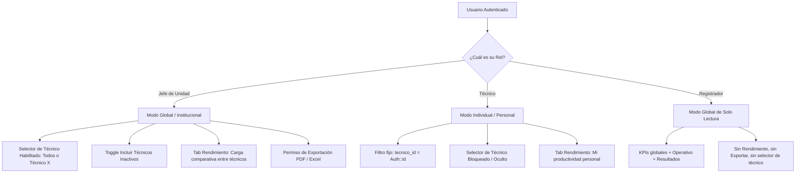

#transparencia
# Sprint 12 — Dashboard Unificado + KPIs + Reportes PDF/Excel 🚀

**Objetivo:** Implementar un **Dashboard General y Adaptativo** para la supervisión global de la UTLCC (Jefe de Unidad) y la gestión personalizada de cada Técnico, reutilizando la misma arquitectura visual y de componentes. Incluye catálogo completo de KPIs bajo la Ley 974, gráficos interactivos con Recharts, filtrado dinámico, vista de reportes tabulares y exportación en PDF / Excel.

**Origen:** Respuestas del cliente #15, #16, #17, #21 — Sesión de validación y requerimientos normativos.

**Estado de planificación:** Sesión de diseño completada y **decisiones cerradas** (Agosto 2026).
§10 resuelto: **Opción A con zonas temporales + badges**. Ver §16 (registro consolidado) y §18 (orden de implementación).

---

## 1. Restricciones de Pantalla y Espacio

**Hardware objetivo:** Monitores de 15 pulgadas, resoluciones **HD (1280×720)** y **Full HD (1920×1080)**.

El layout ocupa el siguiente espacio fijo permanente:
- Navbar superior: ~60px
- Sidebar colapsado: ~64px de ancho

**Área útil estimada para contenido del dashboard:**
| Resolución | Ancho útil | Alto útil | Restricción |
|---|---|---|---|
| HD (1280×720) | ~1216px | ~620px | **Crítica — diseño mínimo** |
| Full HD (1920×1080) | ~1856px | ~980px | Cómoda |

> **Regla de diseño:** Todo el dashboard debe ser visible en HD **sin scroll** dentro de la zona de gráficos. Los gráficos deben tener `height: 260px` mínimo en HD y pueden crecer a `360-400px` en Full HD (responsive).

---

## 2. Visión Arquitectónica: Dashboard Único Adaptativo ✅

### 2.1 El Problema de Dashboards Separados
* Crear un dashboard para el Jefe y otro para cada técnico duplica componentes, lógica de cálculo, hooks y mantenimiento.
* Obliga al Jefe a salir del panel general para revisar la situación puntual de un técnico.

### 2.2 La Solución: Un Solo Dashboard con *Scoping* Dinámico ✅ DECIDIDO
Un único componente de página (`Dashboard.tsx`) y un único controlador base (`DashboardController.php`) que ajusta su comportamiento según el rol del usuario autenticado:



> **Registrador (provisional):** no tendrá dashboard propio. Muy probablemente el dashboard **global de
> solo lectura**. Decisión final pendiente de consulta al cliente y de los **permisos dinámicos** (Sprint 16).
> Mientras tanto, el backend le devuelve el modo global sin selector de técnico, sin Tab Rendimiento y sin exportación.

### 2.3 Regla de Seguridad en Backend (Server-Side Scoping) ✅
* Si `Auth::user()->rol === 'tecnico'`, el backend **ignora cualquier `tecnico_id` enviado por URL** y fuerza `$tecnicoId = Auth::id()`.
* Si `Auth::user()->rol === 'jefe'`, el backend permite `$tecnicoId = null` (global) o un id específico (drill-down).

---

## 3. Ciclo de Vida Completo de los Casos (para cobertura del dashboard)

El plan original solo cubría los estados activos. El análisis completo del esquema BD revela **3 dimensiones** que el dashboard debe cubrir:

### 3.1 Estados del sistema (`denuncias.estado`)

```
ENTRADA             EVALUACIÓN            DECISIÓN       OPERATIVO           TERMINAL
─────────           ──────────────        ─────────      ──────────────      ──────────
ingresada ─────────► evaluacion_tecnica ──┐              asignada
    (5d hábiles         (delegada)        ├──► admitida ──► investigacion ──► cerrada
     para decidir,                        │       └──────── informe ─────────► (subestado:
     Art. 23)                             └──► rechazada                       archivada)
```

### 3.2 Subestados
- `estado = 'cerrada'` + `subestado = NULL` → Cerrada normal
- `estado = 'cerrada'` + `subestado = 'archivada'` → Archivada

> ⏸️ **TODO pendiente con cliente:** Confirmar si `archivada` tendrá flujo propio o permanece como subestado. Por ahora se trata como subestado de `cerrada` y el **Embudo la muestra como barra separada** `cerrada · archivada`, para responder "¿cuántos archivados hay?" sin romper la regla de los KPIs de estado actual.

### 3.3 Escenarios (`denuncias.escenario`)
- `revelada` / `anonimo` / `reservada` → Relevante para privacidad en reportes y para analítica futura.

---

## 4. Catálogo de KPIs — 8 Tarjetas ✅ DECIDIDO

Calculados en tiempo real. Las cards están **siempre visibles** (no dentro de tabs). En HD: 2 filas de 4 cards compactas. En Full HD: 1 fila de 8.

| # | Indicador | Zona / Badge | Cálculo / Fuente | Filtros que respeta |
|---|---|---|---|---|
| **1** | **Casos Activos** | 📌 Estado actual | `estado NOT IN ('rechazada','cerrada')` | técnico, tipo, categoría, clasificación |
| **2** | **Pendientes Admisión** | 📌 Estado actual | `estado IN ('ingresada','evaluacion_tecnica')` | técnico, tipo, categoría, clasificación |
| **3** | **Próximos a Vencer** | 📌 Estado actual | `dias_restantes <= 5 AND >= 0` (via `DiasHabiles`) | técnico, tipo, categoría, clasificación |
| **4** | **En Mora / Vencidos** | 📌 Estado actual | `dias_restantes < 0` (via `DiasHabiles`) | técnico, tipo, categoría, clasificación |
| **5** | **% Cumplimiento de Plazos** | 📅 `cierres.cerrado_at` | `cerradas_en_plazo / total_cerradas × 100` | clasificación, técnico |
| **6** | **Rechazadas (período)** | 📅 `denuncias.fecha_rechazada` | `estado='rechazada'` filtrado por `fecha_rechazada` en rango | tipo, categoría |
| **7** | **Admitidas sin Asignar** | 📌 Estado actual | `estado='admitida' AND tecnico_id IS NULL` | tipo, categoría |
| **8** | **Split Tipo** | 📅 `denuncias.created_at` | `% Corrupción / % Negación` como mini-badges en una card — intake del período | — (el filtro Tipo no aplica) |

> **Regla de zonas (Q5, decidido):** KPIs con badge **📌** son estado actual y **no usan el rango de
> fechas** ni el filtro de Estado; KPIs con badge **📅** usan su campo natural y el rango. En **modo
> Técnico** se ocultan los KPIs **6 y 7** (no aplican: las rechazadas no tienen `tecnico_id` y un
> técnico nunca tiene casos "sin asignar"). Ver §16.

> **Decisión Q1 ✅:** El split Corrupción/Negación va como **KPI Card #8** (no como gráfico de dona/pie). Ocupa menos espacio, es igualmente informativo y no hay riesgo de escala porque el catálogo de tipos es fijo en config.

---

## 5. Gráficos — Sin Pie Charts ✅ DECIDIDO

**Decisión de diseño:** Se eliminan todos los Pie Charts / Donuts. Los catálogos (`clasificaciones`, `medios_notificacion`, `categorias`) son variables — el cliente puede agregar items desde el Panel Admin y un Pie Chart se vuelve ilegible rápidamente.

**Regla:** Toda proporción/distribución se expresa como **`BarChart` horizontal** con etiquetas completas y valores numéricos.

**Excepción de escala para Categorías:** 12 categorías en seed, escalable a más. Usar `BarChart` horizontal con `layout="vertical"` en Recharts, altura fija y las **Top N** (ej. top 8) con opción "ver más" si hay más.

---

## 6. Layout Definitivo: 3 Tabs + Filtros + KPIs Fijos ✅ DECIDIDO

```
┌──────────────────────────────────────────────────────────────────────────────┐
│  🧩 Filtros (Sheet lateral)   [chip][chip][chip]         [⬇ Exportar·Jefe]  │  ← fila delgada sticky (~40px)
├──────────┬──────────┬──────────┬──────────┬──────────┬──────────┬────────────┤
│Activos📌 │Pend.Adm📌│Próx.Venc📌│ En Mora📌 │%Cumplim📅│Rechazad📅│SinAsignar📌│  ← fila 1
│          │          │          │          │          │          │            │
├──────────┴──────────┴──────────┴──────────┴──────────┴──────────┴────────────┤
│  [Split Tipo: X% Corrupción / Y% Negación 📅]                    (card #8)   │  ← fila 2
├──────────────────────────────────────────────────────────────────────────────┤
│  [ 🔄 Operativo ]   [ 📊 Resultados ]   [ 👥 Rendimiento ]                   │
├──────────────────────────────────────────────────────────────────────────────┤
│                                                                              │
│         CONTENIDO DEL TAB ACTIVO (height fijo, sin scroll)                  │
│         2 gráficos lado a lado (50% / 50%) o 1 gráfico ancho                │
│                                                                              │
└──────────────────────────────────────────────────────────────────────────────┘
```

> **Q8/Q9 (decidido):** Los filtros viven en un **Sheet lateral** abierto por el botón 🧩; la fila sticky
> muestra solo los **chips de filtros activos** (clic para quitar uno individual). El botón **⬇ Exportar**
> (solo Jefe) abre un **Modal de exportación** con vista previa + PDF/Excel, sin salir de la página.

> **Decisión Q3 ✅:** Al abrir el dashboard por primera vez → **Tab Operativo** como default, rango de fechas = **último mes**, sin otros filtros activos.

### Tab 1: Operativo (tab por defecto)
Estado actual del pipeline y evolución temporal.

| Zona | Gráfico | Tipo | Descripción |
|---|---|---|---|
| Izquierda | Embudo por Fase | `BarChart` horizontal | Casos en cada estado del flujo. Activos en colores semánticos, rechazadas/cerradas en gris diferenciado |
| Derecha | Evolución Temporal | `AreaChart` | **3 líneas:** Ingresadas / Cerradas / **Rechazadas** (nuevo) con granularidad adaptativa |

**Granularidad adaptativa del AreaChart:**
```php
$granularidad = match(true) {
    $dias <= 14  => 'day',    // DATE(campo)
    $dias <= 90  => 'week',   // YEARWEEK(campo)
    default      => 'month',  // DATE_FORMAT(campo, '%Y-%m')
};
```

> **Nota del embudo (Q6, decidido):** es un **snapshot del estado actual (HOY)**, no un funnel de conversión
> ni una serie del período. **No responde al rango de fechas** (badge 📌). Muestra el conteo actual de todos
> los estados del flujo; `rechazada` y `cerrada` aparecen en gris (terminales) y `cerrada · archivada` se
> muestra como **barra separada**. El rango de fechas vive solo en el AreaChart de evolución.

### Tab 2: Resultados
Outcomes de los casos: clasificaciones, medios y dependencias GAMEA.

| Zona | Gráfico | Tipo | Campo de fecha usado |
|---|---|---|---|
| Superior izquierda | Casos por Clasificación Final | `BarChart` horizontal | `informes_finales.redactado_at` |
| Superior derecha | Top Dependencias GAMEA (roll-up) | `BarChart` horizontal | `solicitudes_informacion.fecha_envio` |
| Inferior izquierda | Cierres por Medio de Notificación | `BarChart` horizontal | `cierres.cerrado_at` |
| Inferior derecha | **[Reservado Sprint 14]** | — | Tiempos entre fases (futuro) |

> **Nota Sprint 14:** El espacio inferior derecho muestra un placeholder "Próximamente: Tiempos entre fases" para no tener que rediseñar el layout en Sprint 14.

### Tab 3: Rendimiento
Carga y eficiencia. Diferenciado por rol.

**Modo Jefe:**
| Zona | Gráfico | Tipo | Descripción |
|---|---|---|---|
| Izquierda | Carga por Técnico | `BarChart` apilado | Barras por técnico: En plazo / Próximos a vencer / Vencidos |
| Derecha | Tabla Casos Urgentes | Tabla | Ticket, Técnico, Días restantes (badge color), Estado |

**Modo Técnico:**
| Zona | Gráfico | Tipo | Descripción |
|---|---|---|---|
| Izquierda | Mi Productividad Mensual | `BarChart` | Casos cerrados mes a mes por el técnico autenticado |
| Derecha | Mis Casos Urgentes | Tabla | Misma tabla filtrada al técnico |

---

## 7. Filtros Globales y Alcance de Cada Uno ✅

| Filtro | Aplica a | Modo Técnico |
|---|---|---|
| **Rango de fechas** | Zona 📅: KPI 5 (`cerrado_at`), KPI 6 (`fecha_rechazada`), KPI 8 (`created_at`), Evolución, Tab Resultados (cada uno su campo natural — ver §10) | ✅ (con scoping) |
| **Técnico** (Jefe only) | KPIs 1/4/7, Embudo, Evolución, Carga técnicos | ❌ oculto — scoping server-side |
| **Tipo** (Corrupción/Negación) | Todos los gráficos excepto Dependencias | ✅ |
| **Categoría** | Embudo de fases, Evolución | ✅ |
| **Clasificación** | Tab Resultados → BarChart clasificaciones; KPI % Cumplimiento | ✅ |
| **Estado** | Embudo y Evolución. **No aplica a los KPIs de estado actual** (siempre sobre activos) | ✅ |
| **Incluir inactivos** (Jefe only) | Recordatorio de técnicos a desactivar en agregaciones por usuario | ❌ oculto |

> **Regla de la zona 📌 (decidido):** el rango de fechas **y** el filtro de Estado **no modifican** los KPIs
> de estado actual ni el Embudo (representan el día de hoy). Esto se comunica con `BaseTemporalBadge` (§16).
> La pregunta "¿cuántos archivados hay?" se responde en el Embudo (barra `cerrada · archivada`) o en reportes.

> **Decisión Q4 ✅:** El filtro de Clasificación va en la **barra global** (no solo en Tab Resultados), para que el Jefe pueda cruzar preguntas como "¿cuántos casos activos están asociados a clasificación X?"

---

## 8. Mapa de Preguntas de Negocio → Dashboard

Preguntas que el Jefe puede responder con los filtros del dashboard:

| Pregunta | Cómo se responde |
|---|---|
| ¿Cuántos casos activos hay hoy? | KPI 1 (sin filtro de fechas — siempre estado actual) |
| ¿Cuántos casos están próximos a vencer? | KPI 3 |
| ¿Cuántos ya vencieron? | KPI 4 |
| ¿Cuál es nuestra tasa de cumplimiento? | KPI 5 |
| ¿Cuántos casos se rechazaron este mes? | KPI 6 + Filtro "Último mes" |
| ¿Hay casos admitidos sin técnico asignado? | KPI 7 → acción inmediata |
| ¿Qué % del intake es corrupción vs. negación? | KPI 8 (split) |
| ¿En qué fase se acumula más trabajo? | Tab Operativo → Embudo |
| ¿A qué paso se resuelven los casos de corrupción? | Filtro tipo=corrupción → Embudo |
| ¿Cuántos casos ingresaron vs. cerraron en Q1? | Tab Operativo → AreaChart, filtro Q1 |
| ¿Cómo fue la tendencia de rechazos en el año? | Tab Operativo → AreaChart (línea 3) |
| ¿Cuáles fueron las clasificaciones más frecuentes? | Tab Resultados → BarChart clasificaciones |
| ¿Qué dependencias generan más solicitudes? | Tab Resultados → BarChart dependencias |
| ¿Cómo se notificó a los denunciados al cierre? | Tab Resultados → BarChart medios |
| ¿Cuántos casos con clasificación X cerramos en Enero? | Filtro clasificación + fechas → Tab Resultados |
| ¿Quién tiene más carga de trabajo? | Tab Rendimiento → Carga técnicos |
| ¿Qué técnico tiene más casos en mora? | Tab Rendimiento → BarChart apilado (segmento vencidos) |
| ¿Qué casos necesitan atención inmediata? | Tab Rendimiento → Tabla urgentes |
| ¿Cuántos casos archivados hay actualmente? | Embudo → barra `cerrada · archivada`; o reportes con filtro `estado=cerrada` + `subestado=archivada` |
| ¿Qué categorías tienen mayor tasa de rechazo? | Filtro por categoría + ver KPI 6 (post-sprint como mejora) |

---

## 9. Módulo de Reportes y Exportación (`/reportes`)

Vista separada del dashboard, accesible solo para Jefe de Unidad.

### 9.1 Vista Tabular
* Tabla interactiva: Ticket, Tipo, Categoría, Técnico, Estado, Días restantes, Fecha ingreso, Acciones.
* Paginación: 20 registros por página.
* Filtros cruzados sincronizados con la misma query base.

### 9.2 Exportación de Documentos
* **Excel (`maatwebsite/excel`):** Conjunto de datos filtrado con formato institucional, cabeceras oficiales, colores de estado.
* **PDF (`barryvdh/laravel-dompdf`):** Formato membretado GAMEA/UTLCC, resumen ejecutivo con tabla de KPIs y listado de denuncias.

### 9.3 Misma query para pantalla y exportación
```php
// ReporteController — misma query base para los 3 destinos
$query = Denuncia::with(['tecnico', 'categoria'])->whereNull('deleted_at')
    ->when($desde,       fn($q,$v) => $q->whereDate('created_at', '>=', $v))
    ->when($hasta,       fn($q,$v) => $q->whereDate('created_at', '<=', $v))
    ->when($tipo,        fn($q,$v) => $q->where('tipo', $v))
    ->when($estado,      fn($q,$v) => $q->where('estado', $v))
    ->when($tecnicoId,   fn($q,$v) => $q->where('tecnico_id', $v))
    ->when($categoriaId, fn($q,$v) => $q->where('categoria_id', $v))
    ->orderByDesc('created_at');

// Pantalla:   ->paginate(20)
// Excel/PDF:  ->get()
```

---

## 10. ✅ DECIDIDO — Campo de Fecha de Referencia (Opción A con zonas + badges)

> **Resuelto en la sesión de planificación (Agosto 2026).** Se adopta la **Opción A** reforzada con
> **dos zonas temporales visuales** y **badges de base temporal** (`BaseTemporalBadge`) en cada gráfico/KPI,
> para que el usuario entienda qué campo de fecha usa cada elemento sin exponer conceptos técnicos.
> Las opciones A/B/C analizadas a continuación quedan como **referencia histórica** del razonamiento.

### El problema
El filtro de rango de fechas del dashboard debe aplicarse a algún campo de fecha de la BD. Pero un caso tiene **múltiples fechas relevantes** en diferentes tablas:

| Campo | Tabla | Significado |
|---|---|---|
| `created_at` | `denuncias` | Cuándo se ingresó/registró |
| `fecha_admitida` | `denuncias` | Cuándo fue admitida |
| `fecha_rechazada` | `denuncias` | Cuándo fue rechazada |
| `redactado_at` | `informes_finales` | Cuándo se redactó el informe |
| `cerrado_at` | `cierres` | Cuándo se cerró el caso |

### El caso concreto que ilustra el problema

```
DEN-2026-0001
  → Ingresado:  10 Diciembre 2025   (created_at)
  → Cerrado:    15 Enero 2026       (cerrado_at)
```

Si el Jefe filtra por **"Enero 2026"**:

| Filtro usa `created_at` | Filtro usa `cerrado_at` |
|---|---|
| ❌ NO aparece (ingresó en Diciembre) | ✅ SÍ aparece (se cerró en Enero) |

Para "¿cuántos casos cerramos en Enero?" el filtro por ingreso da respuesta **incorrecta**.

---

### Opción A — Cada gráfico usa su campo natural *(recomendada)*

Un solo selector de rango de fechas en la UI, pero **cada gráfico y KPI lo aplica al campo que le corresponde naturalmente**:

| Elemento | Campo de fecha que usa |
|---|---|
| KPIs 1-4 y 7 (estado actual) | Sin filtro de fecha — siempre el estado HOY |
| KPI 5 (% Cumplimiento) | `cierres.cerrado_at` |
| KPI 6 (Rechazadas del período) | `denuncias.fecha_rechazada` |
| KPI 8 (Split Tipo) | `denuncias.created_at` (intake del período) |
| Tab Operativo — Embudo | **Sin filtro de fecha — estado actual HOY** (Q6: snapshot, no serie del período) |
| Tab Operativo — AreaChart línea "Ingresadas" | `denuncias.created_at` |
| Tab Operativo — AreaChart línea "Cerradas" | `cierres.cerrado_at` |
| Tab Operativo — AreaChart línea "Rechazadas" | `denuncias.fecha_rechazada` |
| Tab Resultados — Clasificaciones | `informes_finales.redactado_at` |
| Tab Resultados — Medios de notificación | `cierres.cerrado_at` |
| Tab Resultados — Dependencias (solicitudes) | `solicitudes_informacion.fecha_envio` |

**Ventajas:**
- UI simple: un solo selector de fechas
- Resultados correctos: cada métrica responde desde su perspectiva natural
- Backend predecible: cada endpoint sabe qué campo usar, sin condicionales en runtime
- Ya es el patrón natural del AreaChart (que por diseño tiene 3 líneas con 3 campos)

**Desventajas:**
- El usuario no controla qué campo usa cada gráfico
- Requiere documentar en tooltips de cada gráfico qué campo está usando (ej. *"Basado en fecha de cierre"*)

---

### Opción B — Todo filtra por `created_at` *(la más simple)*

Todo el dashboard filtra por fecha de **ingreso** del caso, sin excepción.

**Ventajas:**
- Una sola query base para todo, sin ningún condicional
- Máxima simplicidad de código

**Desventajas:**
- El gráfico de clasificaciones y cierres queda **casi vacío** para períodos cortos, porque los casos que ingresaron esta semana todavía no tienen informe ni cierre
- Filtro "Esta semana" en Tab Resultados → clasificaciones muestra 0, aunque haya muchos casos cerrados esta semana
- KPI 6 (Rechazadas) filtraría por `created_at` de casos que *luego* fueron rechazados (confuso)

---

### Opción C — Selector de campo de fecha en la UI *(la más flexible)*

Un dropdown adicional en la barra de filtros:

```
[📅 Enero 2026] [Filtrar por: Fecha Ingreso ▼]
                               ├── Fecha Ingreso (created_at)
                               ├── Fecha Cierre (cerrado_at)
                               └── Fecha Informe (redactado_at)
```

Todos los gráficos usan el campo seleccionado.

**Ventajas:**
- Control total para el Jefe

**Desventajas:**
- Complejidad UX: ¿sabe el usuario qué campo está eligiendo? Puede generar confusión
- Backend: queries condicionales en todos los endpoints (`CASE WHEN $campoFecha = 'cerrado_at' THEN...`)
- En HD la barra de filtros ya es ajustada — agregar otro campo puede saturarla
- No todos los campos aplican a todos los gráficos (dependencias usa `fecha_envio`, que no es ninguna de las 3 opciones)

---

### Decisión final del Jefe de Proyecto (Agosto 2026)

**Opción A** con la siguiente adaptación de UX:

1. El dashboard se organiza en **2 zonas temporales**:
   - **📌 ZONA "ESTADO ACTUAL"** — KPIs 1/2/3/4/7, Embudo y Tabla de urgentes. No usan el rango de fechas;
     responden a técnico/tipo/categoría/clasificación.
   - **📅 ZONA "ACTIVIDAD DEL PERÍODO"** — KPI 5 (`cerrado_at`), KPI 6 (`fecha_rechazada`), KPI 8 (`created_at`),
     Evolución (3 líneas) y Tab Resultados (clasificaciones `redactado_at`, medios `cerrado_at`,
     dependencias `fecha_envio`).
2. Cada bloque lleva un **`BaseTemporalBadge`** (`📌 Estado actual — no usa el rango de fechas` /
   `📅 Según fecha de cierre`, etc.) + tooltip explicativo, evitando la frustración de
   "este gráfico no responde a los filtros".
3. **No** se implementa el selector global de campo (Opción C): sobre-ingeniería con casos N/A en
   dependencias/embudo/split, conflicto con el AreaChart de 3 líneas y un concepto administrativo poco amigable.
4. **No** se adopta la Opción B: respuestas incorrectas (Tab Resultados vacío en períodos cortos y
   KPI 5/6 distorsionados).

**Backend predecible:** cada endpoint usa su campo de fecha sin condicionales en runtime (ver §12).

---

## 11. Mejoras Futuras (documentadas, no en este sprint)

### Drill-down en gráficos (Q2 — aprobado como mejora post-sprint) ✅
Al hacer click en una barra de cualquier gráfico (ej. "Falta de indicios"), se abre un modal con la tabla de casos de esa clasificación, filtrada automáticamente con los mismos filtros activos.

**Nota técnica:** El modal puede reutilizar `TablaReporte.tsx` pasando filtros pre-aplicados. El eje click → endpoint ya está mapeado en `ReporteController` con filtros `when()`, solo falta el componente de UI.

> Este plus complementa directamente la funcionalidad de reportes PDF/Excel: el Jefe ve el gráfico, hace click, ve los casos, y desde ahí exporta solo esos casos.

### Persistencia del tab activo
Guardar en `localStorage` o query param `?tab=operativo` el último tab visitado. Baja complejidad, alto confort de uso diario.

### Análisis por escenario de denuncia
Gráfico de anónimas vs. reveladas vs. reservadas — útil si el cliente necesita entender el perfil del ciudadano denunciante. Datos ya disponibles en `denuncias.escenario`.

### Análisis de tasa de rechazo por categoría
"¿Cuáles categorías tienen mayor tasa de rechazo?" — requiere query cruzada entre `denuncias.categoria_id` y `denuncias.estado`. Útil para detectar si la ciudadanía entiende qué puede denunciar.

---

## 12. Reglas de Negocio (Backend)

### Regla `users.activo`
```php
// Toda agregación por usuario filtra activos por defecto
User::where('rol', 'tecnico')
    ->when(!$incluirInactivos, fn($q) => $q->where('activo', true));
```

Toggle "Incluir inactivos" → sirve de recordatorio al Jefe de técnicos que ya no trabajan en el área.

### Roll-up de Árbol de Dependencias
Suma recursiva de solicitudes desde hojas hacia padres (unidad → dirección → secretaría → GAMEA). Se implementa en PHP sobre ~185 nodos (instantáneo, más mantenible que CTE en MySQL).

### Cálculo de Plazos con `DiasHabiles`
```php
// KPIs 3, 4 y 5 dependen del accessor plazo del modelo
$activas = Denuncia::whereNotIn('estado', ['rechazada', 'cerrada'])
    ->with('ampliaciones')
    ->get();

$proximosAVencer = $activas->filter(
    fn($d) => ($d->plazo['dias_restantes'] ?? 0) <= 5
           && ($d->plazo['dias_restantes'] ?? 0) >= 0
)->count();

$vencidos = $activas->filter(
    fn($d) => ($d->plazo['dias_restantes'] ?? 0) < 0
)->count();
```

### KPIs nuevos — Consultas adicionales

**KPI 6 — Rechazadas en el período:**
```php
$rechazadas = Denuncia::where('estado', 'rechazada')
    ->when($desde, fn($q) => $q->whereDate('fecha_rechazada', '>=', $desde))
    ->when($hasta, fn($q) => $q->whereDate('fecha_rechazada', '<=', $hasta))
    ->count();
```

**KPI 7 — Admitidas sin técnico asignado:**
```php
$sinAsignar = Denuncia::where('estado', 'admitida')
    ->whereNull('tecnico_id')
    ->count();
```

**Línea 3 del AreaChart — Rechazadas por período:**
```php
$rechazadasPorPeriodo = Denuncia::whereNull('deleted_at')
    ->where('estado', 'rechazada')
    ->when($desde, fn($q) => $q->whereDate('fecha_rechazada', '>=', $desde))
    ->when($hasta, fn($q) => $q->whereDate('fecha_rechazada', '<=', $hasta))
    ->selectRaw("DATE_FORMAT(fecha_rechazada, '{$formato}') as periodo, COUNT(*) as total")
    ->groupBy('periodo')->orderBy('periodo')
    ->get();
```

### Correcciones a las consultas preparadas (bugs detectados en `Consultas - Dashboard y Reportes.md`)

> Aplicar ANTES de implementar el backend. Ver también §18.

**B1 — KPI 5 (% Cumplimiento) rompe con casos cerrados.** El accessor `Denuncia::getPlazoAttribute()`
devuelve `null` cuando `estado ∈ {rechazada, cerrada}`, pero `Consultas` §3.4 lee `$d->plazo['fecha_vencimiento']`
sobre casos `cerrada` → crash. **Fix:** extraer un método puro `Denuncia::calcularVencimiento()` que calcule
el vencimiento (5/45/20 días hábiles + ampliaciones) **independiente del estado**, y usarlo en KPI 5.

```php
// En app/Models/Denuncia.php
public function calcularVencimiento(?Carbon $desde = null): Carbon
{
    $baseFecha = $this->fecha_admitida
        ? Carbon::parse($this->fecha_admitida)
        : Carbon::parse($desde ?? $this->created_at);

    $diasBase = in_array($this->estado, ['ingresada', 'evaluacion_tecnica'])
        ? 5
        : ($this->tipo === 'corrupcion' ? 45 : 20);

    $diasAmpliados = $this->relationLoaded('ampliaciones')
        ? $this->ampliaciones->sum('dias')
        : (int) $this->ampliaciones()->sum('dias');

    return DiasHabiles::agregar($diasBase + $diasAmpliados, $baseFecha);
}
```

**B2 — Roll-up de dependencias no arranca.** El ejemplo de `Consultas` §5.2 invoca `$calcular(0)`, pero la
raíz GAMEA se crea con `parent_id = null` (`CatalogoSeeder`), no `0`. **Fix:** `RollUpDependencias` parte
de los nodos raíz (`parent_id = null`) y, para el Top, **excluye la raíz GAMEA** (Q10) mostrando niveles 2–3.

**B3 — Filtro de borrado inconsistente.** Unificar `eliminado = false` en `informes_finales`, `cierres` y
`solicitudes_informacion` (no mezclar con `whereNull('fecha_eliminacion')`).

**Granularidad adaptativa con llenado continuo:** el AreaChart construye todos los períodos del rango
(day/week/month) inicializados en `0` para evitar huecos; las 3 líneas comparten la misma clave de período.

---

## 13. Componentes y Archivos a Construir

### Backend
* **[NEW]** `app/Http/Controllers/DashboardController.php` — 8 KPIs + datos de 3 tabs + scoping por rol + mapa `base_temporal`
* **[NEW]** `app/Http/Controllers/ReporteController.php` — `index` (tabla paginada) + `preview` (JSON para el modal) + `exportar` (PDF/Excel), todos sobre la misma `queryBase()`
* **[NEW]** `app/Exports/ReporteExcel.php`
* **[NEW]** `resources/views/reportes/pdf.blade.php`
* **[NEW]** `app/Helpers/RollUpDependencias.php` — roll-up por árbol partiendo de raíces (`parent_id = null`), excluye raíz GAMEA del Top
* **[MODIFY]** `app/Models/Denuncia.php` — +`calcularVencimiento()` (independiente del estado; fix B1)
* **[MODIFY]** `routes/web.php` — `/dashboard`, `/reportes`, `/reportes/preview`, `/reportes/exportar` a controladores reales

### Frontend — Dashboard
* **[MODIFY]** `resources/js/Pages/Dashboard.tsx` — Layout 3 tabs + fila de chips + 2 filas KPIs (según rol)
* **[NEW]** `resources/js/Components/Dashboard/FiltrosDashboard.tsx` — Botón 🧩 + chips de filtros activos + **Sheet lateral** (shadcn `sheet`)
* **[NEW]** `resources/js/Components/Dashboard/BaseTemporalBadge.tsx` — Badge 📌 "Estado actual" / 📅 "Según <campo>" + tooltip
* **[NEW]** `resources/js/Components/Dashboard/KPICards.tsx` — 8 tarjetas compactas (6 en modo técnico) con `BaseTemporalBadge`
* **[NEW]** `resources/js/Components/Dashboard/TabOperativo.tsx` — Embudo (snapshot HOY) + AreaChart (período)
* **[NEW]** `resources/js/Components/Dashboard/TabResultados.tsx` — Clasificaciones + Medios + Dependencias
* **[NEW]** `resources/js/Components/Dashboard/TabRendimiento.tsx` — Carga técnicos (Jefe) / Mi productividad (Técnico) + Tabla urgentes
* **[NEW]** `resources/js/Components/Dashboard/GraficoEmbudo.tsx` — BarChart horizontal por fase
* **[NEW]** `resources/js/Components/Dashboard/GraficoEvolucion.tsx` — AreaChart 3 líneas (granularidad adaptativa + llenado de períodos)
* **[NEW]** `resources/js/Components/Dashboard/GraficoCargaTecnicos.tsx` — BarChart apilado
* **[NEW]** `resources/js/Components/Dashboard/TablaCasosUrgentes.tsx` — Tabla con badge días + link a caso (reutiliza `DenunciaSheet`)
* **[NEW]** `resources/js/Components/Dashboard/ModalExportar.tsx` — Resumen de filtros + preview 10 filas + toggle PDF/Excel + Descargar

### Frontend — Reportes
* **[MODIFY]** `resources/js/Pages/Reportes/Index.tsx`
* **[NEW]** `resources/js/Components/Reportes/TablaReporte.tsx`
* **[NEW]** `resources/js/Components/Reportes/FiltrosReporte.tsx`
* **[NEW]** `resources/js/Components/Reportes/BotonExportar.tsx`

---

## 14. Dependencias

```bash
npm install recharts
composer require maatwebsite/excel barryvdh/laravel-dompdf
npx shadcn@latest add dropdown-menu  # table/tabs/switch/select/sheet ya existen
```

> **dompdf + español:** publicar la configuración (`php artisan vendor:publish --tag=dompdf`) y cargar la
> fuente **DejaVu Sans** para acentos/ñ/ü en el PDF membretado.

---

## 15. Criterios de Aceptación (Definition of Done)

1. **Sin scroll en HD:** Todo visible en 1280×720 con sidebar colapsado — sin scroll en la zona de gráficos
2. **Filtro por defecto:** Al cargar → Tab Operativo, rango = último mes, sin filtros adicionales
3. **Sin Pie Charts:** Todos los gráficos usan `BarChart` horizontal o `AreaChart`
4. **KPI 7 visible y accionable:** Si hay casos admitidos sin asignar, el número aparece inmediatamente al cargar
5. **Rechazados cubiertos:** KPI 6 + línea 3 del AreaChart + embudo incluyen el ciclo de rechazos
6. **Scoping server-side:** Un técnico no puede ver métricas de otros mediante manipulación de parámetros URL
7. **Exportación consistente:** PDF y Excel reflejan exactamente los mismos filtros activos en pantalla
8. **Drill-down documentado:** `ModalDrillDown.tsx` en backlog (no en este sprint), interfaz preparada para agregarlo
9. **Suite de pruebas:** `tests/Feature/DashboardTest.php` y `tests/Feature/ReporteTest.php` al 100% en SQLite `:memory:`
10. **Badges de base temporal:** Todo gráfico/KPI muestra `BaseTemporalBadge` (📌 "Estado actual" / 📅 "Según <campo>")
11. **Scoping por rol completo:** Técnico ve 6 KPIs (sin 6/7), sin filtro de técnico, sin inactivos, sin exportar; Registrador ve global de solo lectura (sin Rendimiento/exportar) hasta decisión del cliente
12. **Embudo snapshot:** El embudo muestra el estado actual del día (sin rango de fechas) y separa `cerrada · archivada`
13. **Filtros sin fuga de espacio:** Barra de filtros en Sheet lateral + chips activos; "sin scroll en HD" con el Sheet cerrado
14. **Exportación desde modal:** El modal de exportación usa la misma query base (`preview` + `exportar`) — consistencia garantizada

---

## 16. Decisiones de diseño — Registro consolidado (Agosto 2026)

Sesión de planificación con el Jefe de Proyecto. Todas las ✅ de este documento resuelven aquí su detalle.

| # | Decisión | Resolución |
|---|---|---|
| Q1 | Split Corrupción/Negación | KPI Card #8 (mini-badges), **📅 del período** (`created_at`) |
| Q2 | Drill-down en gráficos | Backlog post-sprint (ver §11) |
| Q3 | Tab/filtro por defecto | Tab **Operativo** + rango "último mes" |
| Q4 | Filtro de clasificación | Barra de filtros global |
| Q5 | Fecha de referencia (§10) | **Opción A + 2 zonas + badges** |
| Q6 | Embudo | **Snapshot estado actual (HOY)**; `cerrada · archivada` como barra separada; sin rango de fechas |
| Q7 | Gráficos no reactivos | `BaseTemporalBadge` + tooltip en su lugar (sin pestañas/modales extra) |
| Q8 | UI de filtros | **Sheet lateral** + fila de chips activos (clic para quitar) + botón 🧩 |
| Q9 | Exportación | **Modal** con resumen de filtros + preview 10 filas + toggle PDF/Excel + enlace a Reportes; descarga vía `GET /reportes/exportar` |
| Q10 | Top Dependencias | Roll-up por árbol excluyendo la raíz GAMEA; niveles 2–3, Top N + "ver más" |
| Q11 | Rol Registrador | **Provisional:** dashboard global de solo lectura (KPIs + Operativo + Resultados), sin Rendimiento ni Exportar. Confirmar con cliente; sujeto a permisos dinámicos (Sprint 16) |
| Q12 | Rol Técnico | Oculta: KPIs 6/7, filtro Técnico, toggle inactivos, botón Exportar. Tab Rendimiento = Mi productividad |
| Q13 | Archivada | Subestado de `cerrada` (flujo propio pendiente cliente). El Embudo la separa visualmente |

### Zonas temporales del dashboard

```
📌 ZONA "ESTADO ACTUAL" (sin rango de fechas)    KPI 1/2/3/4/7 · Embudo · Tabla de urgentes
📅 ZONA "ACTIVIDAD DEL PERÍODO" (usa el rango)   KPI 5/6/8 · Evolución · Tab Resultados
```

---

## 17. Contrato de datos del Dashboard (props de `Dashboard.tsx`)

```ts
type BaseTemporal =
  | 'estado_actual' | 'created_at' | 'cerrado_at'
  | 'redactado_at' | 'fecha_rechazada' | 'fecha_envio';

interface Props {
  kpis: {
    activos: number; pendientesAdmision: number; proximosAVencer: number;
    vencidos: number; cumplimiento: number; rechazadas: number;
    sinAsignar: number; split: { corrupcion: number; negacion: number };
  };
  operativo: {
    embudo: Array<{ estado: string; label: string; total: number; esTerminal: boolean }>;
    evolucion: Array<{ periodo: string; ingresadas: number; cerradas: number; rechazadas: number }>;
    granularidad: 'day' | 'week' | 'month';
  };
  resultados: {
    clasificaciones: Array<{ label: string; value: number }>;
    medios: Array<{ label: string; value: number }>;
    dependencias: Array<{ label: string; value: number }>;
  };
  rendimiento: {
    modo: 'jefe' | 'tecnico';
    cargaTecnicos?: Array<{ tecnico: string; enPlazo: number; proximos: number; vencidos: number }>;
    productividad?: Array<{ mes: string; cerrados: number }>;
    urgentes: Array<{ ticket: string; tecnico: string; diasRestantes: number; color: string; estado: string }>;
  };
  baseTemporal: Record<string, BaseTemporal>;  // badge por bloque (kpis.*, operativo.embudo, etc.)
  opciones: { tecnicos: Array<{ id: number; name: string; activo: boolean }> };  // solo Jefe
  esJefe: boolean; esTecnico: boolean; esRegistrador: boolean;
  filtros: {
    desde: string | null; hasta: string | null; tecnicoId: number | null;
    tipo: string | null; categoriaId: number | null; clasificacionId: number | null;
    estado: string | null; incluirInactivos: boolean; tab: string;
  };
}
```

> El frontend deriva los badges de `baseTemporal`. El `DashboardController` calcula los 3 tabs en una sola
> respuesta para que el cambio de tab sea instantáneo (Inertia + `preserveState`).

---

## 18. Orden de implementación

1. Instalar dependencias (`recharts`, `maatwebsite/excel`, `barryvdh/laravel-dompdf`, shadcn `dropdown-menu`) + configurar dompdf (DejaVu Sans)
2. Fixes de consultas: `Denuncia::calcularVencimiento()` (B1), `RollUpDependencias` (B2), filtros `eliminado = false` unificados (B3)
3. `DashboardController` (scoping por rol + KPIs + 3 tabs + `base_temporal` + granularidad con llenado continuo)
4. Rutas: `/dashboard`, `/reportes`, `/reportes/preview`, `/reportes/exportar`
5. Componentes dashboard: `FiltrosDashboard` (Sheet+chips) → `KPICards` + `BaseTemporalBadge` → tabs → gráficos → `ModalExportar`
6. `ReporteController` (index/preview/exportar con `queryBase()`) + `ReporteExcel` + `pdf.blade.php`
7. Página `Reportes/Index.tsx` + `TablaReporte` + `FiltrosReporte` + `BotonExportar`
8. Tests: `tests/Feature/DashboardTest.php` + `tests/Feature/ReporteTest.php` (SQLite `:memory:`, 100%)
9. (Opcional) seed con denuncias demo del último mes para que el rango default "último mes" no se vea vacío
10. Actualizar `Consultas - Dashboard y Reportes.md` (corregir B1/B2/B3) y marcar §10 como resuelto

### Pendientes para el cliente (no bloquean el sprint)
- **Registrador:** ¿acceso al dashboard global? (se decide con permisos dinámicos, Sprint 16)
- **Archivada:** subestado vs. flujo propio (por ahora subestado; el embudo la muestra separada)
- **C7:** destino del expediente al remitirse al Ministerio
- **C8:** reglas del plazo al reabrir una denuncia
